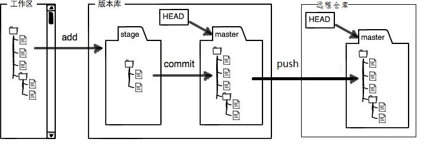

# conda

- conda env list

可以查看我们已经安装成功的所有环境。

- conda create -n <envname> <python版本>

比如 conda create -n py2 python=2.7

创建python2.7版本的环境，命名为py2

-  conda activate <env name> 激活到某个环境

conda install <package name> 安装指定的包

比如conda install tensorflow

- conda list 显示所有的安装包

- conda remove -n <env name> --all 删除指定环境中所有的包即删除环境

比如conda remove -n pytorch1.2 --all

- conda remove/clean <package name> 删除指定的包

# Python

## 内置函数

- len()  求长度
  - 当输入值是个张量时，返回的是张量的行数

- 将指定对象插入列表的指定位置

  - index -- 对象 obj 需要插入的索引位置。

  - obj -- 要插入列表中的对象。

  - ```
    list.insert(index, obj)
    ```

- 函数用于比较2个对象，如果 x < y 返回 -1, 如果 x == y 返回 0, 如果 x > y 返回 1

  - ```
    cmp( x, y )
    ```

- isinstance() 函数来判断一个对象是否是一个已知的类型，类似 type()。

  - object -- 实例对象。

  - classinfo -- 可以是直接或间接类名、基本类型或者由它们组成的元组。

  - ```
    isinstance(object, classinfo)
    ```

- eval() 函数用来执行一个字符串表达式，并返回表达式的值。

  - expression -- 表达式。

  - globals -- 变量作用域，全局命名空间，如果被提供，则必须是一个字典对象。

  - locals -- 变量作用域，局部命名空间，如果被提供，可以是任何映射对象。

  - ```
    eval(expression[, globals[, locals]])
    ```

- numel()函数：返回数组中元素的个数

- **zip()** 函数用于将可迭代的对象作为参数，将对象中对应的元素打包成一个个元组，然后返回由这些元组组成的列表。

  如果各个迭代器的元素个数不一致，则返回列表长度与最短的对象相同，利用 * 号操作符，可以将元组解压为列表。

-  assert（断言）用于判断一个表达式，在表达式条件为 false 的时候触发异常。

  - 断言可以在条件不满足程序运行的情况下直接返回错误，而不必等待程序运行后出现崩溃的情况，

    ```
    >>> assert True     # 条件为 true 正常执行
    >>> assert False    # 条件为 false 触发异常
    Traceback (most recent call last):
      File "<stdin>", line 1, in <module>
    AssertionError
    >>> assert 1==1    # 条件为 true 正常执行
    >>> assert 1==2    # 条件为 false 触发异常
    Traceback (most recent call last):
      File "<stdin>", line 1, in <module>
    AssertionError
    
    >>> assert 1==2, '1 不等于 2'
    Traceback (most recent call last):
      File "<stdin>", line 1, in <module>
    AssertionError: 1 不等于 2
    >>>
    ```

    


### 文件操作

- open()  打开文件
- close()   关闭文件
- （建议使用）with open(...) as ... 以..名打开文件,
  - **fp = open("test.txt",w)**   直接打开一个文件，**如果文件不存在则创建文件**

- read() 读取文件全部内容

　注意 open() 之后 一定要 close()。但由于文件读写时都可能产生IOError，为了保证无论是否出错都能正确地关闭文件，我们用 try ... finally 来实现：

```python
file="C:\\a.txt"
try:
	f=open(file,"r")
	print(f.read())
finally:
    if f:
    	f.close()
# with open .. as ..是上面一套流程的省略，建议使用。
with open(file,"r") as f:
    print(f.read())
```

| 模式 | 描述                                                         |
| ---- | ------------------------------------------------------------ |
| r    | 以只读方式打开文件。文件的指针将会放在文件的开头。这是默认模式。 |
| rb   | 以二进制格式打开一个文件用于只读。文件指针将会放在文件的开头。这是默认模式。 |
| r+   | 打开一个文件用于读写。文件指针将会放在文件的开头。           |
| rb+  | 以二进制格式打开一个文件用于读写。文件指针将会放在文件的开头。 |
| w    | 打开一个文件只用于写入。如果该文件已存在则将其覆盖。如果该文件不存在，创建新文件。 |
| wb   | 以二进制格式打开一个文件只用于写入。如果该文件已存在则将其覆盖。如果该文件不存在，创建新文件。 |
| w+   | 打开一个文件用于读写。如果该文件已存在则将其覆盖。如果该文件不存在，创建新文件。 |
| wb+  | 以二进制格式打开一个文件用于读写。如果该文件已存在则将其覆盖。如果该文件不存在，创建新文件。 |
| a    | 打开一个文件用于追加。如果该文件已存在，文件指针将会放在文件的结尾。也就是说，新的内容将会被写入到已有内容之后。如果该文件不存在，创建新文件进行写入。 |
| ab   | 以二进制格式打开一个文件用于追加。如果该文件已存在，文件指针将会放在文件的结尾。也就是说，新的内容将会被写入到已有内容之后。如果该文件不存在，创建新文件进行写入。 |
| a+   | 打开一个文件用于读写。如果该文件已存在，文件指针将会放在文件的结尾。文件打开时会是追加模式。如果该文件不存在，创建新文件用于读写。 |
| ab+  | 以二进制格式打开一个文件用于追加。如果该文件已存在，文件指针将会放在文件的结尾。如果该文件不存在，创建新文件用于读写。 |

#### file对象

　file 为一对象，它有一些内置属性，如下

| file.closed    | 表示文件已经被关闭，否则为False                              |
| -------------- | ------------------------------------------------------------ |
| file.mode      | Access文件打开时使用的访问模式                               |
| file.encoding  | 文件所使用的编码                                             |
| file.name      | 文件名                                                       |
| file.newlines  | 未读取到行分隔符时为None，只有一种行分隔符时为一个字符串，当文件有多种类型的行结束符时，则为一个包含所有当前所遇到的行结束的列表 |
| file.softspace | 为0表示在输出一数据后，要加上一个空格符，1表示不加。这个属性一般程序员用不着，由程序内部使用 |

- read()  一次读取文件内所有内容（可能会溢出内存）
- read(size)  读取指定大小的字节数，反复调用可避免溢出
- readline()   读取一行
- readlines()  一次读取所有内容并按行返回list。

```python
file="C:\\a.txt"
with open(file,"r") as f:
    print(f.read())
    
f=open(file."r")
content="" #定义一个字符串存放取出的内容
try:
    while Ture:
        chunk=f.read(9)   #一次读取9个字节
        print chunk
        if not chunk:
            break
        content += chunk #每次迭代取出的内容都加到								 #content中
finnaly:
    f.close()
print(content)

---------------------
file="C:\\a.txt"
with open(file,"r") as f:
    poet_list=f.readlines()
print type(poet_list)
for i in poet_list:
    print i
    
```

- write()

  写文件和读文件是一样的，唯一区别是调用open()函数时，传入标识符'w'或者'wb'表示写文本文件或写二进制文件；'a' 对应的表示追加等。

  如文件不存在则会创建后写入

  

## random模块

- random.shuffle(list) 将序列的所有元素随机排序

## OS模块

- os.makedirs(name, mode=511, exist_ok=False)

  递归目录创建函数。与 mkdir() 类似，但会自动创建到达最后一级目录所需要的中间目录。

  mode 参数会传递给 mkdir()，用来创建最后一级目录，对于该参数的解释，请参阅 mkdir() 中的描述。

  如果 exist_ok 为 False (默认值)，则如果目标目录已存在将引发 FileExistsError。

- os.path.join(path, *paths)

  智能地拼接一个或多个路径部分。 返回值是 *path* 和 **paths* 的所有成员的拼接，其中每个非空部分后面都紧跟一个目录分隔符，最后一个部分除外，这意味着如果最后一个部分为空，则结果将以分隔符结尾。 如果某个部分为绝对路径，则之前的所有部分会被丢弃并从绝对路径部分开始继续拼接。

  **连接函数join是否能新生成文件？**

  今天碰到一个问题，就是我用os.path.join()连接两个文件名地址的时候，就比os.path.join("D:\","test.txt")结果是D:\test.txt，并且在我们往里面写东西，然后保存，在这个目录下会生成这个文件，但是如果你不写东西，那么执行这句话之后，在D盘的目录下是不会有这个文件名称的。这个时候，如果你想执行这句话之后生成一个目录或文件名，那么可以这样：os.mkdir(os.path.join("D:\","test.txt"))这样就可以了。所以说os.path.join("D:\","test.txt")的功能仅仅是连接的作用，而不能生成。

## pandas模块

- read_csv

### dataframe类

- dataframe.iloc[] 截取二维数组中的一块

- dataframe.fillna() 对空值NaN进行填充

- DataFrame.mean() 求平均值

- dataframe.drop() 删除特定的行或列

- dataframe.isna() 检查空值,返回值也是一个dataframe

  - 统计空值可用 dataframe.isna().sum()

- dataframe.sum() 对指定的行或者列进行统计

  Pandas DataFrame.sum()函数用于返回用户所请求轴的值之和。如果输入值是索引轴, 则它将在列中添加所有值, 并且对所有列都相同。它返回一个序列, 其中包含每一列中所有值的总和。

  在计算DataFrame中的总和时, 它还能够跳过DataFrame中的缺失值。

- dataframe.dict() 转化为字典

- 

## torch模块

- torch.tensor(a) 转化为张量 /定义张量
- 张量t.reshape() 改变张量形状
  - -1代表n，是张量的个数
  - reshape（）的几种用法
  - 转化成1行：reshape(1,-1)
  - 转化成2行：reshape(2,-1)
  - 转化成1列：reshape(-1,1)
  - 转化成2列：reshape(-1,2)
- torch.normal(means, std, out=None) 返回一个张量，包含从给定参数means,std的离散正态分布中抽取随机数。 均值means是一个张量，包含每个输出元素相关的正态分布的均值。 std是一个张量，包含每个输出元素相关的正态分布的标准差。 均值和标准差的形状不须匹配，但每个张量的元素个数须相同。
  - means (Tensor) – 均值
  - std (Tensor) – 标准差
  - out (Tensor) – 可选的输出张量
  - 大意是返回一个张量，张量里面的随机数是从相互独立的正态分布中随机生成的。
  - normal输出可以指定输出的形状：
  - y += torch.normal(0, 0.01, y.shape)
  - w = torch.normal(0, 0.01, size=(2,1), requires_grad=True)


- torch.matmul() 矩阵相乘
  - 矩阵相乘有`torch.mm(a, b)`和`torch.matmul(a, b)`两个函数。
  - 前一个是针对二维矩阵，后一个是高维。当`torch.mm(a, b)`用于大于二维时将报错。
- 被with torch.no_grad()包住的代码，不用跟踪反向梯度计算，
  - **首先明确一点，no_grad与detach有异曲同工之妙，都是逃避autograd的追踪。**
  - [torch](https://so.csdn.net/so/search?q=torch&spm=1001.2101.3001.7020).no_grad()两个作用：新增的tensor没有梯度，使带梯度的tensor能够进行原地运算。
    - 1.使带有梯度的[tensor](https://so.csdn.net/so/search?q=tensor&spm=1001.2101.3001.7020)能够原地运算（更新tensor）
    - 2.使带有梯度的tensor能够原地运算（更新tensor）,新建的tensor不能传递梯度。
    - 3.注意原地操作（更新tensor）之前不能用到相应tensor，如果用到，后面求梯度就不对之前用到tensor的tensor进行求导，否则报错：
    - 4.每轮训练需要梯度清零操作`optimizer.zero_grad()`的原因：从输出中可以看出，每执行一次`backward()`，对应tensor的梯度都会自加`1`，即梯度自动累加，所以需要每个`batch_size`都执行梯度清零`.zero_grad()`操作。


### torch.utils.data

- class torch.utils.data.Dataset 表示Dataset的抽象类。

- class torch.utils.data.TensorDataset(data_tensor, target_tensor) 包装数据和目标张量的数据集。通过沿着第一个维度索引两个张量来恢复每个样本。
  - **data_tensor** (*Tensor*) －　包含样本数据
  - **target_tensor** (*Tensor*) －　包含样本目标（标签）
- class torch.utils.data.DataLoader(dataset, batch_size=1, shuffle=False, sampler=None, num_workers=0, collate_fn=<function default_collate>, pin_memory=False, drop_last=False) 数据加载器。组合数据集和采样器，并在数据集上提供单进程或多进程迭代器。
  - **dataset** (*Dataset*) – 加载数据的数据集。
  - **batch_size** (*int*, optional) – 每个batch加载多少个样本(默认: 1)。
  - **shuffle** (*bool*, optional) – 设置为`True`时会在每个epoch重新打乱数据(默认: False).
  - **sampler** (*Sampler*, optional) – 定义从数据集中提取样本的策略。如果指定，则忽略`shuffle`参数。
  - **num_workers** (*int*, optional) – 用多少个子进程加载数据。0表示数据将在主进程中加载(默认: 0)
  - **collate_fn** (*callable*, optional) –
  - **pin_memory** (*bool*, optional) –
  - **drop_last** (*bool*, optional) – 如果数据集大小不能被batch size整除，则设置为True后可删除最后一个不完整的batch。如果设为False并且数据集的大小不能被batch size整除，则最后一个batch将更小。(默认: False)

### torch.nn

#### Parameters

class torch.nn.Parameter()

`Variable`的一种，常被用于模块参数(`module parameter`)。

`Parameters` 是 `Variable` 的子类。`Paramenters`和`Modules`一起使用的时候会有一些特殊的属性，即：当`Paramenters`赋值给`Module`的属性的时候，他会自动的被加到 `Module`的 参数列表中(即：会出现在 `parameters() 迭代器中`)。将`Varibale`赋值给`Module`属性则不会有这样的影响。 这样做的原因是：我们有时候会需要缓存一些临时的状态(`state`), 比如：模型中`RNN`的最后一个隐状态。如果没有`Parameter`这个类的话，那么这些临时变量也会注册成为模型变量。

`Variable` 与 `Parameter`的另一个不同之处在于，`Parameter`不能被 `volatile`(即：无法设置`volatile=True`)而且默认`requires_grad=True`。`Variable`默认`requires_grad=False`。

参数说明:

- data (Tensor) – parameter tensor.
- requires_grad (bool, optional) – 默认为`True`，在`BP`的过程中会对其求微分。

#### Containers容器

##### class torch.nn.Module 

torch.nn.module是所有神经网络模块的基本类型，所有的模型都是这个类的子类。

同时模块可以嵌套（允许使用树状结构）

- apply(fn)

  将fn递归应用于每个子模块（由.children（）返回）以及self。典型的用法包括初始化模型的参数（另请参见torch.nn.init）。


- .add_module(name,module) 向当前模型中添加子模块

  - 将一个 `child module` 添加到当前 `modle`。 被添加的`module`可以通过 `name`属性来获取。 例：

    ```
    import torch.nn as nn
    class Model(nn.Module):
        def __init__(self):
            super(Model, self).__init__()
            self.add_module("conv", nn.Conv2d(10, 20, 4))
            #self.conv = nn.Conv2d(10, 20, 4) 和上面这个增加module的方式等价
    model = Model()
    print(model.conv)
    ```

    

- .childeren() 一个迭代器，返回模型中的所有子模块

- .modules() 返回一个包含当前模型的所有模块的迭代器

  - model.modules()和model.children()均为迭代器，model.modules()会遍历model中所有的子层，而model.children()仅会遍历当前层

- .named_children() 返回 包含 模型当前子模块 的迭代器，`yield` 模块名字和模块本身。

  ```
  for name, module in model.named_children():
      if name in ['conv4', 'conv5']:
          print(module)
  ```

- .cpu(device_id=None)  将所有的模型参数(`parameters`)和`buffers`复制到`CPU`

- .cuda(device_id=None)  将所有的模型参数(parameters)和buffers赋值GPU

  - device_id (int, optional) – 如果指定的话，所有的模型参数都会复制到指定的设备上。

- .double()   将`parameters`和`buffers`的数据类型转换成`double`。

- .float() 同理

- .half() 同理

- .eval()    将模型设置成evaluation模式,仅仅当模型中有Dropout和BatchNorm是才会有影响。

  - 在训练模型时会在前面加上：
  - model.train()
  - 在测试模型时在前面使用：
  - model.eval()
  - 一般的神经网络中，这两种模式是一样的，只有当模型中存在dropout和batchnorm的时候才有区别。为了训练出更加准确的网络参数，一旦我们用测试集进行结果测试的时候，一定要使用net.eval()把dropout关掉，因为这里我们的目的是测试训练好的网络，而不是在训练网络，没有必要再dropout。

- .train(model=True) 同上

- .forward(\*input) 定义了每次执行的计算步骤，所有的子类中都需要重写这个函数

- .parameters(memo=None)  **返回一个 包含模型所有参数 的迭代器。一般用来当作`optimizer`的参数。**

  ```
  for param in model.parameters():
      print(type(param.data), param.size())
  
  <class 'torch.FloatTensor'> (20L,)
  <class 'torch.FloatTensor'> (20L, 1L, 5L, 5L)
  ```

- .zero_grad() 将`module`中的所有模型参数的梯度设置为0.清空梯度信息


##### class torch.nn.Sequential(* args)

 一个时序容器。`Modules` 会以他们传入的顺序被添加到容器中。当然，也可以传入一个`OrderedDict`有序字典。

为了更容易的理解如何使用`Sequential`, 下面给出了一个例子:

```
 Example of using Sequential

model = nn.Sequential(
          nn.Conv2d(1,20,5),
          nn.ReLU(),
          nn.Conv2d(20,64,5),
          nn.ReLU()
        )
# Example of using Sequential with OrderedDict
model = nn.Sequential(OrderedDict([
          ('conv1', nn.Conv2d(1,20,5)),
          ('relu1', nn.ReLU()),
          ('conv2', nn.Conv2d(20,64,5)),
          ('relu2', nn.ReLU())
        ]))
```

-  torch.flatten(x)等于torch.flatten(x，0)默认将张量拉成一维的向量，也就是说**从第一维开始平坦化，torch.flatten(x，1)代表从第二维开始平坦化。**
  - 把数据拉平
- 对于torch.nn.Flatten()，因为其被用在神经网络中，输入为一批数据，**第一维为batch**，通常要把一个数据拉成一维，而不是将一批数据拉为一维。**所以torch.nn.Flatten()默认从第二维开始平坦化。**
- 

##### 卷积层

- class torch.nn.Conv1d(in_channels, out_channels, kernel_size, stride=1, padding=0, dilation=1, groups=1, bias=True)

  一维卷积层

- class torch.nn.Conv2d(in_channels, out_channels, kernel_size, stride=1, padding=0, dilation=1, groups=1, bias=True)

  二位卷积层

- class torch.nn.Conv3d(in_channels, out_channels, kernel_size, stride=1, padding=0, dilation=1, groups=1, bias=True)

  三维卷积层

- class torch.nn.ConvTranspose1d(in_channels, out_channels, kernel_size, stride=1, padding=0, output_padding=0, groups=1, bias=True)

  1维的解卷积操作（`transposed convolution operator`，注意改视作操作可视作解卷积操作，但并不是真正的解卷积操作） 该模块可以看作是`Conv1d`相对于其输入的梯度，有时（但不正确地）被称为解卷积操作。

- class torch.nn.ConvTranspose2d

- class torch.nn.ConvTranspose3d

##### 池化层

- class torch.nn.MaxPool1d(kernel_size, stride=None, padding=0, dilation=1, return_indices=False, ceil_mode=False)

  对于输入信号的输入通道，提供1维最大池化（`max pooling`）操作

- class torch.nn.MaxPool2d

- class torch.nn.MaxPool3d

- class torch.nn.MaxUnpool1d(kernel_size, stride=None, padding=0)

  `Maxpool1d`的逆过程，不过并不是完全的逆过程，因为在`maxpool1d`的过程中，一些最大值的已经丢失。 `MaxUnpool1d`输入`MaxPool1d`的输出，包括最大值的索引，并计算所有`maxpool1d`过程中非最大值被设置为零的部分的反向。

- class torch.nn.MaxUnpool2d(kernel_size, stride=None, padding=0)

- class torch.nn.MaxUnpool3d(kernel_size, stride=None, padding=0)

- class torch.nn.AvgPool1d(kernel_size, stride=None, padding=0, ceil_mode=False, count_include_pad=True)

  对信号的输入通道，提供1维平均池化（average pooling ）

- class torch.nn.AvgPool2d(kernel_size, stride=None, padding=0, ceil_mode=False, count_include_pad=True)

- class torch.nn.AvgPool3d(kernel_size, stride=None)

- class torch.nn.AdaptiveMaxPool1d(output_size, return_indices=False)

  对输入信号，提供1维的自适应最大池化操作 对于任何输入大小的输入，可以将输出尺寸指定为H，但是输入和输出特征的数目不会变化。

- class torch.nn.AdaptiveMaxPool2d(output_size, return_indices=False)

- class torch.nn.AdaptiveAvgPool1d(output_size)

  对输入信号，提供1维的自适应平均池化操作 对于任何输入大小的输入，可以将输出尺寸指定为H*W，但是输入和输出特征的数目不会变化。

- class torch.nn.AdaptiveAvgPool2d(output_size)


##### 线性层

- class torch.nn.Linear(in_features, out_features, bias=True)
  对输入数据做线性变换：y=Ax+b
  - **in_features** - 每个输入样本的大小
  - **out_features** - 每个输出样本的大小
  - **bias** - 若设置为False，这层不会学习偏置。默认值：True

##### 非线性层

- class torch.nn.ReLU(inplace=False) 对输入运用修正线性单元函数${ReLU}(x)= max(0, x)$
- class torch.nn.ReLU6(inplace=False) 对输入的每一个元素运用函数${ReLU6}(x) = min(max(0,x), 6)$
- class torch.nn.ELU(alpha=1.0, inplace=False) 对输入的每一个元素运用函数$f(x) = max(0,x) + min(0, alpha * (e^x - 1))$

- class torch.nn.Threshold(threshold, value, inplace=False)
  - threshhold定义：$y =  x ,if\ x >= threshold\ y = value,if\ x <  threshold$

- class torch.nn.Hardtanh(min_value=-1, max_value=1, inplace=False) 
- class torch.nn.Sigmoid
- class torch.nn.Tanh
- class torch.nn.Softmax

##### 正则化层

- class torch.nn.BatchNorm1d(num_features, eps=1e-05, momentum=0.1, affine=True)

  对小批量(mini-batch)的2d或3d输入进行批标准化(Batch Normalization)操作

- class torch.nn.BatchNorm2d

- class torch.nn.BatchNorm3d

##### 循环层

- class torch.nn.RNN( *args,* * kwargs)[source]

  将一个多层的 `Elman RNN`，激活函数为`tanh`或者`ReLU`，用于输入序列。

- class torch.nn.LSTM( *args,* * kwargs)[source]

  将一个多层的 `(LSTM)` 应用到输入序列。

- class torch.nn.GRU( *args,* * kwargs)[source]

  将一个多层的`GRU`用于输入序列。

- class torch.nn.RNNCell(input_size, hidden_size, bias=True, nonlinearity='tanh')[source]

  一个 `Elan RNN cell`，激活函数是`tanh`或`ReLU`，用于输入序列。 将一个多层的 `Elman RNNCell`，激活函数为`tanh`或者`ReLU`，用于输入序列。 $$ h'=tanh(w_{ih} *x+b_{ih}+w_{hh}* h+b_{hh}) $$ 如果`nonlinearity=relu`，那么将会使用`ReLU`来代替`tanh`。

- class torch.nn.LSTMCell(input_size, hidden_size, bias=True)[source]

  `LSTM cell`。 $$ \begin{aligned} i &= sigmoid(W_{ii}x+b_{ii}+W_{hi}h+b_{hi}) \ f &= sigmoid(W_{if}x+b_{if}+W_{hf}h+b_{hf}) \ o &= sigmoid(W_{io}x+b_{io}+W_{ho}h+b_{ho})\ g &= tanh(W_{ig}x+b_{ig}+W_{hg}h+b_{hg})\ c' &= f_t*c_{t-1}+i_t*g_t\ h' &= o_t*tanh(c') \end{aligned} $$

- class torch.nn.GRUCell(input_size, hidden_size, bias=True)[source]

  一个`GRU cell`。 $$ \begin{aligned} r&=sigmoid(W_{ir}x+b_{ir}+W_{hr}h+b_{hr})\ i&=sigmoid(W_{ii}x+b_{ii}+W_{hi}h+b_{hi})\ n&=tanh(W_{in}x+b_{in}+r*(W_{hn}h+b_{hn}))\ h'&=(1-i)* n+i*h \end{aligned} $$

  

##### dropout层

- class torch.nn.Dropout(p=0.5, inplace=False)
  随机将输入张量中部分元素设置为0。对于每次前向调用，被置0的元素都是随机的。

#### 距离函数

- class torch.nn.PairwiseDistance(p=2, eps=1e-06)
  按批计算向量v1, v2之间的距离：

#### 损失函数

基本用法：

```
criterion = LossCriterion() #构造函数有自己的参数
loss = criterion(x, y) #调用标准时也有参数
```

**计算出来的结果已经对`mini-batch`取了平均。**

- class torch.nn.L1Loss(size_average=True)

  创建一个衡量输入`x`(`模型预测输出`)和目标`y`之间差的绝对值的平均值的标准。

- class torch.nn.MSELoss(size_average=True)

  创建一个衡量输入`x`(`模型预测输出`)和目标`y`之间均方误差标准。

- class torch.nn.CrossEntropyLoss(weight=None, size_average=True)

  此标准将`LogSoftMax`和`NLLLoss`集成到一个类中。

  当训练一个多类分类器的时候，这个方法是十分有用的。

  - weight(tensor): `1-D` tensor，`n`个元素，分别代表`n`类的权重，如果你的训练样本很不均衡的话，是非常有用的。默认值为None。用来平衡样本之间的不平衡；

  调用时参数：

  - input : 包含每个类的得分，`2-D` tensor,`shape`为 `batch*n`

  - target: 大小为 `n` 的 `1—D` `tensor`，包含类别的索引(`0到 n-1`)。

  - Input: (N,C) `C` 是类别的数量

  - Target: (N) `N`是`mini-batch`的大小，0 <= targets[i] <= C-1

  - reduction ：用来指定损失结果返回的是mean、sum还是none。

    - 使用reduction='mean’的同时指定weights的时候，不会产生任何错误，而且reduction='mean’也是默认的参数值；
      使用reduction='none’的同时指定weights的时候，会导致产生的结果有错误，这是因为当我们指定reduction='none’的时候，该函数不会对结果使用weight进行规范化。

    - 

    - ```
      'none'`: no reduction will be applied, `'mean'`: the weighted mean of the output is taken, `'sum'`: the output will be summed. Note: `size_average` and `reduce` are in the process of being deprecated, and in the meantime, specifying either of those two args will override `reduction`. Default: `'mean'
      ```

    - 

      


- class torch.nn.NLLLoss(weight=None, size_average=True)

  负的`log likelihood loss`损失。用于训练一个`n`类分类器。

- class torch.nn.NLLLoss2d(weight=None, size_average=True)

  对于图片的 `negative log likehood loss`。计算每个像素的 `NLL loss`。

- class torch.nn.KLDivLoss(weight=None, size_average=True)

  计算 KL 散度损失。

  KL散度常用来描述两个分布的距离，并在输出分布的空间上执行直接回归是有用的。

#### 多GPU并行层

- class torch.nn.DataParallel(module, device_ids=None, output_device=None, dim=0)

  在模块级别上实现数据并行。

  此容器通过将`mini-batch`划分到不同的设备上来实现给定`module`的并行。在`forward`过程中，`module`会在每个设备上都复制一遍，每个副本都会处理部分输入。在`backward`过程中，副本上的梯度会累加到原始`module`上。

  batch的大小应该大于所使用的GPU的数量。还应当是GPU个数的整数倍，这样划分出来的每一块都会有相同的样本数量。


### torch.nn.init

负责模型的初始化

- torch.nn.init.calculate_gain(nonlinearity,param=None)
  对于给定的非线性函数，返回推荐的增益值。这些值如下所示：

  | nonlinearity | gain                         |
  | ------------ | ---------------------------- |
  | linear       | 1                            |
  | conv{1,2,3}d | 1                            |
  | sigmoid      | 1                            |
  | tanh         | 5/3                          |
  | relu         | sqrt(2)                      |
  | leaky_relu   | sqrt(2/(1+negative_slope^2)) |

  参数：

  - **nonlinearity** - 非线性函数（`nn.functional`名称）
  - **param** - 非线性函数的可选参数

- torch.nn.init.uniform(tensor, a=0, b=1)

  从均匀分布U(a, b)中生成值，填充输入的张量或变量

  **参数：**

  - **tensor** - n维的torch.Tensor
  - **a** - 均匀分布的下界
  - **b** - 均匀分布的上界

- torch.nn.init.normal(tensor, mean=0, std=1)

  从给定均值和标准差的正态分布N(mean, std)中生成值，填充输入的张量或变量

  参数：

  tensor – n维的torch.Tensor
  mean – 正态分布的均值
  std – 正态分布的标准差

- torch.nn.init.constant(tensor, val)

  用*val*的值填充输入的张量或变量

  **参数：**

  - **tensor** – n维的torch.Tensor或autograd.Variable
  - **val** – 用来填充张量的值

- torch.nn.init.eye(tensor)
  用单位矩阵来填充2维输入张量或变量。在线性层尽可能多的保存输入特性。

  **参数：**

  - **tensor** – 2维的torch.Tensor或autograd.Variable

- torch.nn.init.dirac(tensor)

  用Dirac $\delta$ 函数来填充{3, 4, 5}维输入张量或变量。在卷积层尽可能多的保存输入通道特性。

  **参数：**

  - **tensor** – {3, 4, 5}维的torch.Tensor或autograd.Variable

- 


### torch.optim优化器

- torch.optim.SGD()

- 

- .step() : 所有的optimizer都实现了step()方法，这个方法会更新所有的参数。

  - 这是大多数optimizer所支持的简化版本。一旦梯度被如backward()之类的函数计算好后，我们就可以调用这个函数。

    ```
    for input, target in dataset:
            optimizer.zero_grad()
            output = model(input)
            loss = loss_fn(output, target)
            loss.backward()
            optimizer.step()         
    optimizer.step(closure)
    ```

    


## torchvision模块

### torchvision.transforms

transforms内置一些常用的图片转换功能。**可以使用`Compose`命令串在一起。**

- 把一些转换操作整合到一起

  - `torchvision.transforms.Compose`(list of `Transform` objects)

    ```
    >>> transforms.Compose([
    >>>     transforms.CenterCrop(10),
    >>>     transforms.PILToTensor(),
    >>>     transforms.ConvertImageDtype(torch.float),
    >>> ])
    ```

    

  - 不支持torchscript

    - In order to script the transformations, please use `torch.nn.Sequential` instead of [`Compose`](https://pytorch.org/vision/stable/transforms.html#torchvision.transforms.Compose).
  
    ```
    transforms = torch.nn.Sequential(
        transforms.CenterCrop(10),
        transforms.Normalize((0.485, 0.456, 0.406), (0.229, 0.224, 0.225)),
    )
    scripted_transforms = torch.jit.script(transforms)
    ```
  
  - 


- **调整PILImage对象的尺寸**，注意不能是用io.imread或者cv2.imread读取的图片，这两种方法得到的是ndarray。

  - torchvision.transforms.Resize()

  - 将图片短边缩放至x，长宽比保持不变：

    ```python
    transforms.Resize(x)
    ```

  - 而一般输入深度网络的特征图长宽是相等的，就不能采取等比例缩放的方式了，需要同时指定长宽：

    ```python
    transforms.Resize([h, w])
    1
    ```

    例如transforms.Resize([224, 224])就能将输入图片转化成224×224的输入特征图。

  - 需要注意的一点是PILImage对象size属性返回的是w, h，而resize的参数顺序是h, w。


一.图片裁剪

- 依据给定的size随机裁剪
  - class torchvision.transforms.RandomCrop(size, padding=None, pad_if_needed=False, fill=0, padding_mode=‘constant’)
- 依据给定的size从中心裁剪
  - class torchvision.transforms.RandomResizedCrop(size, scale=(0.08, 1.0), ratio=(0.75, 1.3333333333333333), interpolation=2)
- 随机大小，随机长宽比裁剪原始图片，最后将图片resize到设定好的size
  - class torchvision.transforms.RandomResizedCrop(size, scale=(0.08, 1.0), ratio=(0.75, 1.3333333333333333), interpolation=2)

- 对图片进行上下左右以及中心裁剪，获得5张图片，返回一个4D-tensor
  - class torchvision.transforms.FiveCrop(size)
- 对图片进行上下左右以及中心裁剪，然后全部翻转（水平或者垂直），获得10张图片，返回一个4D-tensor。
  - class torchvision.transforms.TenCrop(size, vertical_flip=False)

二.翻转和旋转

- 依据概率p对PIL图片进行水平翻转
  - class torchvision.transforms.RandomHorizontalFlip(p=0.5)
- 依据概率p对PIL图片进行垂直翻转
  - class torchvision.transforms.RandomVerticalFlip(p=0.5)
- 依degrees随机旋转一定角度
  - class torchvision.transforms.RandomRotation(degrees, resample=False, expand=False, center=None)

三.图像变换

- 重置图像分辨率
  - class torchvision.transforms.Resize(size, interpolation=2)
- 对数据按通道进行标准化，即先减均值，再除以标准差，注意是 hwc
  - class torchvision.transforms.Normalize(mean, std)
- 将PIL Image或者 ndarray 转换为tensor，并且归一化至[0-1]
  注意事项：归一化至[0-1]是直接除以255，若自己的ndarray数据尺度有变化，则需要自行修改。
  - class torchvision.transforms.ToTensor
- 对图像进行填充
  - class torchvision.transforms.Pad(padding, fill=0, padding_mode=‘constant’)
- 修改修改亮度、对比度和饱和度
  - class torchvision.transforms.ColorJitter(brightness=0, contrast=0, saturation=0, hue=0)
- 将图片转换为灰度图
  - class torchvision.transforms.Grayscale(num_output_channels=1)

- 对矩阵做线性变化，可用于白化处理！
  - class torchvision.transforms.LinearTransformation(transformation_matrix)
- 放射变换
  - class torchvision.transforms.RandomAffine(degrees, translate=None, scale=None, shear=None, resample=False, fillcolor=0)

- 依概率p将图片转换为灰度图，若通道数为3，则3 channel with r == g == b
  - class torchvision.transforms.RandomGrayscale(p=0.1)
- 将tensor 或者 ndarray的数据转换为 PIL Image 类型数据
  - class torchvision.transforms.ToPILImage(mode=None)

四.对transforms操作，使数据增强更灵活

- 随机从给定的一系列transforms中选一个进行操作：transforms.RandomChoice(transforms)
- 给一个transform加上概率，以一定的概率执行该操作：
  - transforms.RandomApply(transforms, p=0.5)
- 将transforms中的操作随机打乱：transforms.RandomOrder

### torchvison.datasets 数据集相关

#### 内置数据集

`torchvision.datasets`中包含了以下数据集

- MNIST
- COCO（用于图像标注和目标检测）(Captioning and Detection)
- LSUN Classification
- ImageFolder
- Imagenet-12
- CIFAR10 and CIFAR100
- STL10

`Datasets` 拥有以下`API`:

```
__getitem__` `__len__
```

由于以上`Datasets`都是 `torch.utils.data.Dataset`的子类，所以，他们也可以通过`torch.utils.data.DataLoader`使用多线程（python的多进程）。

举例说明： `torch.utils.data.DataLoader(coco_cap, batch_size=args.batchSize, shuffle=True, num_workers=args.nThreads)`

在构造函数中，不同的数据集直接的构造函数会有些许不同，但是他们共同拥有 `keyword` 参数。 In the constructor, each dataset has a slightly different API as needed, but they all take the keyword args: - `transform`： 一个函数，原始图片作为输入，返回一个转换后的图片。（详情请看下面关于`torchvision-tranform`的部分）

- `target_transform` - 一个函数，输入为`target`，输出对其的转换。例子，输入的是图片标注的`string`，输出为`word`的索引。


#### MNIST

```
dset.MNIST(root, train=True, transform=None, target_transform=None, download=False)
```

- root : `processed/training.pt` 和 `processed/test.pt` 的主目录 
- train : `True` = 训练集, `False` = 测试集 
- download : `True` = 从互联网上下载数据集，并把数据集放在`root`目录下. 如果数据集之前下载过，将处理过的数据（minist.py中有相关函数）放在`processed`文件夹下。

#### FasionMNIST

```
torchvision.datasets.FashionMNIST()
```

Args：

- root (string): 数据集所在目录（训练集和测试集存在的地方） ``FashionMNIST/processed/training.pt``

​       ``FashionMNIST/processed/test.pt`` 

-  train (bool, optional):可选参数，Ture/False

  为真时从训练集中创建数据集

  为假时从测试集中创建数据集 

  If True, creates dataset from ``training.pt``,

​      otherwise from ``test.pt``.

- download (bool, optional): 可选参数，Ture/False

  为真时从网上下载数据集，放在root参数指定的目录中，若已存在则不会下载。

  If true, downloads the dataset from the internet and puts it in root directory. If dataset is already downloaded, it is not downloaded again.

- transform (callable, optional): 调用transforms函数

  A function/transform that  takes in an PIL image and returns a transformed version. E.g, ``transforms.RandomCrop``

- target_transform (callable, optional): A function/transform that takes in the target and transforms it.


#### COCO

需要安装COCOAPI

[cocoapi/PythonAPI at master · cocodataset/cocoapi · GitHub](https://github.com/cocodataset/cocoapi/tree/master/PythonAPI)

等等还有其他数据集

[torchvision.datasets - PyTorch中文文档 (pytorch-cn.readthedocs.io)](https://pytorch-cn.readthedocs.io/zh/latest/torchvision/torchvision-datasets/)


## matplotlib模块

- %matplotlib inline     其实这一句是IPython的魔法函数，可以在IPython编译器里直接使用，作用是内嵌画图，省略掉plt.show()这一步，直接显示图像。

  如果不加这一句的话，我们在画图结束之后需要加上plt.show()才可以显示图像。

# Git

## 基本命令

- 个人本地使用

| 行为                        | 命令                                                         | 备注                                                         |
| :-------------------------- | :----------------------------------------------------------- | :----------------------------------------------------------- |
| 初始化                      | [init](https://www.cnblogs.com/schaepher/p/5561193.html#init) | 在本地的当前目录里初始化git仓库                              |
|                             | [clone 地址](https://www.cnblogs.com/schaepher/p/5561193.html#clone) | 从网络上某个地址拷贝仓库(repository)到本地                   |
| 查看当前状态                | [status](https://www.cnblogs.com/schaepher/p/5561193.html#status) | 查看当前仓库的状态。碰到问题不知道怎么办的时候，可以通过看它给出的提示来解决问题。这个命令执行的频率应该是其他命令的几倍，特别是新手 |
| 查看不同                    | [diff](https://www.cnblogs.com/schaepher/p/5561193.html#diff) | 查看当前状态和最新的commit之间不同的地方                     |
|                             | diff 版本号1 版本号2                                         | 查看两个指定的版本之间不同的地方。这里的版本号指的是commit的hash值 |
| 添加文件                    | [add -A](https://www.cnblogs.com/schaepher/p/5561193.html#add) | 这算是相当通用的了。在commit之前要先add                      |
| 撤回修改的且还未stage的内容 | [checkout -- .](https://www.cnblogs.com/schaepher/p/5561193.html#checkout) | 这里用小数点表示撤回所有修改，在`--`的前后都有空格           |
| 提交                        | [commit -m "提交信息"](https://www.cnblogs.com/schaepher/p/5561193.html#commit) | 提交信息最好能体现更改了什么                                 |
| 删除未tracked               | [clean -xf](https://www.cnblogs.com/schaepher/p/5561193.html#clean) | 删除当前目录下所有没有track过的文件。不管它是否是.gitignore文件里面指定的文件夹和文件 |
| 查看提交记录                | [log](https://www.cnblogs.com/schaepher/p/5561193.html#log)  | 查看当前版本及之前的commit记录                               |
|                             | [reflog](https://www.cnblogs.com/schaepher/p/5561193.html#reflog) | HEAD的变更记录                                               |
| 版本回退                    | [reset --hard 版本号](https://www.cnblogs.com/schaepher/p/5561193.html#reset) | 回退到指定版本号的版本，该版本之后的修改都被删除。同时也是通过这个命令回到最新版本。需要reflog配合 |

- 个人远程使用

| 行为           | 命令                                                         | 备注                                                   |
| :------------- | :----------------------------------------------------------- | :----------------------------------------------------- |
| 设置用户名     | [config --global user.name "你的用户名"](https://www.cnblogs.com/schaepher/p/5561193.html#config_user) |                                                        |
| 设置邮箱       | [config --global user.email "你的邮箱"](https://www.cnblogs.com/schaepher/p/5561193.html#config_email) |                                                        |
| 生成ssh key    | [ssh-keygen -t rsa -C "你的邮箱"](https://www.cnblogs.com/schaepher/p/5561193.html#ssh_key) | 这条命令前面不用加git                                  |
| 添加远程仓库   | [remote add origin 你复制的地址](https://www.cnblogs.com/schaepher/p/5561193.html#remote_add) | 设置origin                                             |
| 上传并指定默认 | [push -u origin master](https://www.cnblogs.com/schaepher/p/5561193.html#push_origin) | 指定origin为默认主机，以后push默认上传到origin上       |
| 提交到远程仓库 | [push](https://www.cnblogs.com/schaepher/p/5561193.html#push) | 将当前分支增加的commit提交到远程仓库                   |
| 从远程仓库同步 | pull                                                         | 在本地版本低于远程仓库版本的时候，获取远程仓库的commit |

## 原理




- workspace 即工作区，逻辑上是本地计算机，还没添加到repository的状态；
- staging 即版本库中的stage，是暂存区。修改已经添加进repository，但还没有作为commit提交，类似于缓存；
- Local repository 即版本库中master那个地方。到这一步才算是成功生成一个新版本；
- Remote repository 则是远程仓库。用来将本地仓库上传到网络，可以用于备份、共享、合作。本文将使用Github作为远程仓库的例子。