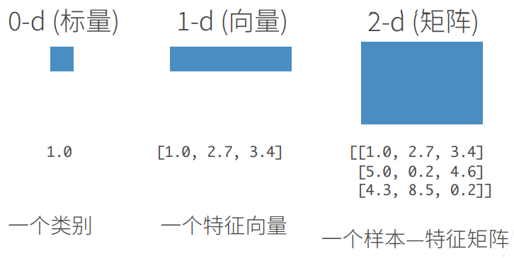
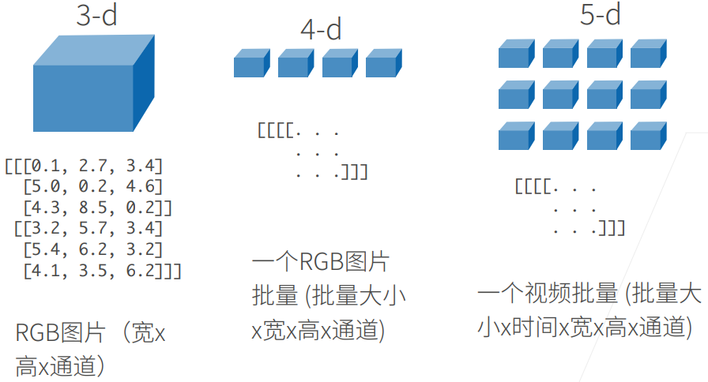
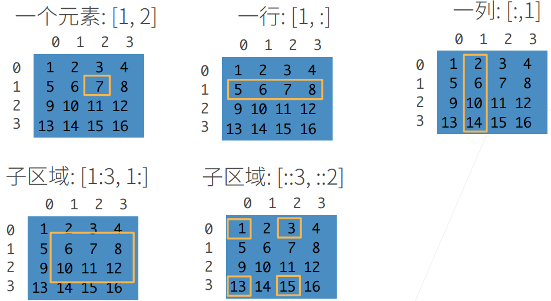
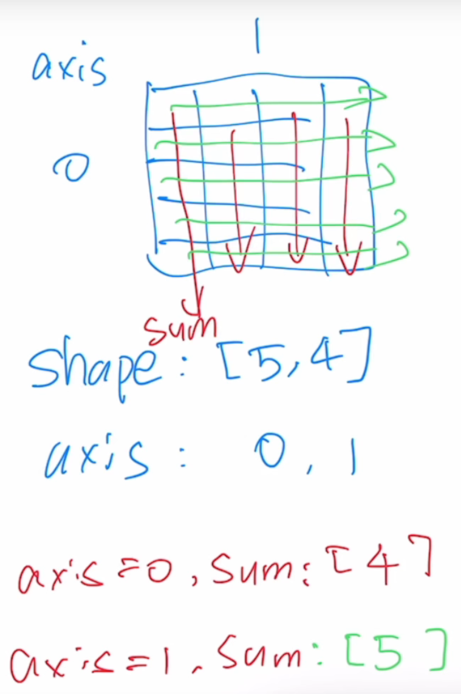
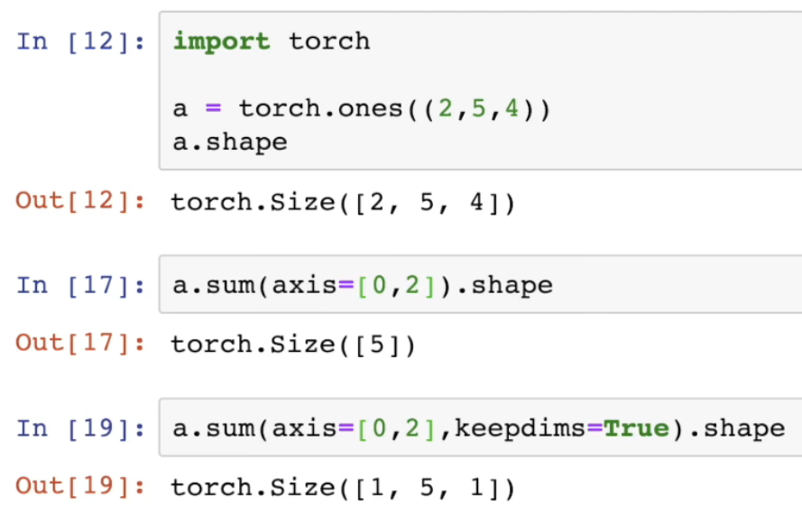
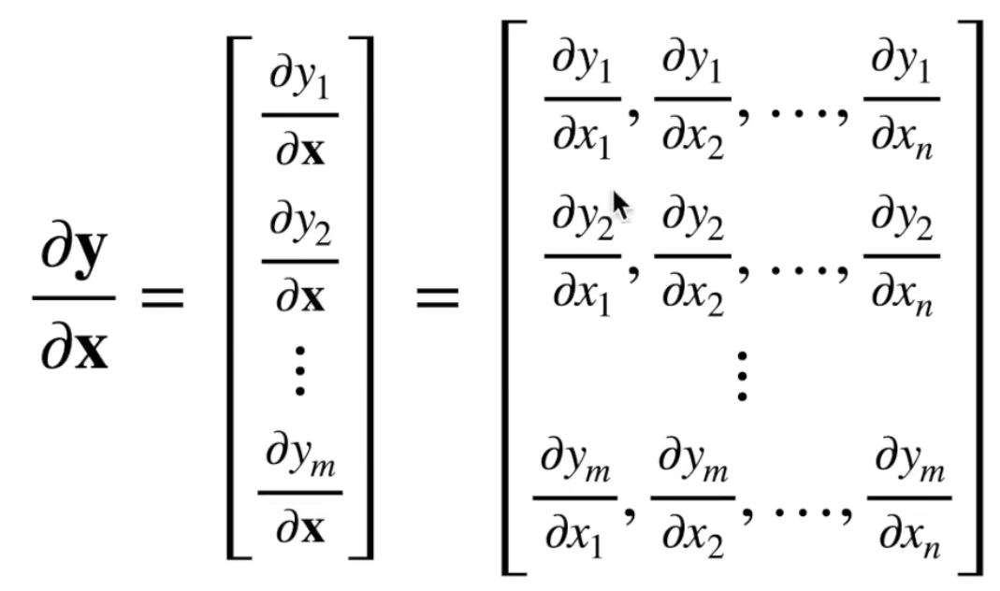
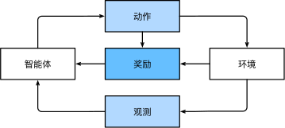

# 安装

Anaconda环境

```python
# conda中新建环境
conda env remove d2l-zh #确保没有重名环境
conda create -n d2l-zh python=3.8 #创建环境，指定python版本
# 如果找不到指定版本，多半是源有问题，更换回默认的源：
conda config --remove-key channels
#切换清华源 清华源官网回公布链接
conda config --add channels https://mirrors.tuna.tsinghua.edu.cn/anaconda/pkgs/main
    
# 检查安装情况
conda env list
conda activate d2l-zh #激活进入环境
# 安装需要的包
pip install d2l==0.17.3
pip install torch==1.8.1
pip install torchvision==0.9.1
pip install jupyter
conda list #检查包安装结果

#启动jupyter笔记
jupyter notebook
# 现在，你可以在Web浏览器中打开http://localhost:8888（通常会自动打开）
```

jupyter运行前使用始终执行`conda activate d2l`以激活运行时环境。 要退出环境，请运行`conda deactivate`。

# 数据基础

## 数据在不同的维度展示

d代表维度division





## 数据操作

首先，我们导入`torch`。请注意，虽然它被称为PyTorch，但是代码中使用`torch`而不是`pytorch`。

```
import torch
```

创建数组：指定形状m x n ，数据类型，数据的值。

**张量表示由一个数值组成的数组，这个数组可能有多个维度**：具有一个轴的张量对应数学上的*向量*（vector）； 具有两个轴的张量对应数学上的*矩阵*（matrix）； **具有两个轴以上的张量没有特殊的数学名称**。

张量中的每个值都称为张量的 *元素*（element）。

- 张量判断：如果*obj* 是一个pytorch张量，则返回True

  ```
  torch.is_tensor(obj)
  ```

- 返回`input` 张量中的元素个数

  ```
  torch.numel(input)->int
  
  >>> a = torch.randn(1,2,3,4,5)
  >>> torch.numel(a)
  120
  >>> a = torch.zeros(4,4)
  >>> torch.numel(a)
  16
  ```

  

- 返回一个2维张量，对角线位置全1，其它位置全0

  - n ([int](https://docs.python.org/2/library/functions.html#int) ) – 行数
  - m ([int](https://docs.python.org/2/library/functions.html#int), *optional*) – 列数.如果为None,则默认为*n*
  - out ([*Tensor*](http://pytorch.org/docs/tensors.html#torch.Tensor), *optinal*) - Output tensor

  ```
  >>> torch.eye(3)
   1  0  0
   0  1  0
   0  0  1
  ```

- Numpy桥，将`numpy.ndarray` 转换为pytorch的 `Tensor`。

  ```
  >>> a = numpy.array([1, 2, 3])
  >>> t = torch.from_numpy(a)
  >>> t
  torch.LongTensor([1, 2, 3])
  >>> t[0] = -1
  >>> a
  array([-1,  2,  3])
  ```

- 返回一个全为1 的张量，形状由可变参数`sizes`定义。

  ```
  >>> torch.ones(2, 3)
  
   1  1  1
   1  1  1
  [torch.FloatTensor of size 2x3]
  
  >>> torch.ones(5)
  
   1
   1
   1
   1
   1
  [torch.FloatTensor of size 5]
  ```

- 返回一个全为标量 0 的张量，形状由可变参数`sizes` 定义。

  ```
  >>> torch.zeros(2, 3)
  
   0  0  0
   0  0  0
  [torch.FloatTensor of size 2x3]
  
  >>> torch.zeros(5)
  
   0
   0
   0
   0
   0
  [torch.FloatTensor of size 5]
  ```

  

- 返回一个张量，包含了从区间[0,1)的均匀分布中抽取的一组随机数，形状由可变参数`sizes` 定义。

  ```
  >>> torch.rand(4)
  
   0.9193
   0.3347
   0.3232
   0.7715
  [torch.FloatTensor of size 4]
  
  >>> torch.rand(2, 3)
  
   0.5010  0.5140  0.0719
   0.1435  0.5636  0.0538
  [torch.FloatTensor of size 2x3]
  ```

- 返回一个张量，包含了从标准正态分布(均值为0，方差为 1，即高斯白噪声)中抽取一组随机数，形状由可变参数`sizes`定义。

  ```
  >>> torch.randn(4)
  
  -0.1145
   0.0094
  -1.1717
   0.9846
  [torch.FloatTensor of size 4]
  
  >>> torch.randn(2, 3)
  
   1.4339  0.3351 -1.0999
   1.5458 -0.9643 -0.3558
  [torch.FloatTensor of size 2x3]
  ```

- 返回一个1维张量，长度为 floor((end−start)/step)floor((end−start)/step)。包含从`start`到`end`，以`step`为步长的一组序列值(默认步长为1)。

  - start (float) – 序列的起始点
  - end (float) – 序列的终止点
  - step (float) – 相邻点的间隔大小
  - out (Tensor, optional) – 结果张量

  ```
  >>> torch.arange(1, 4)
  
   1
   2
   3
  [torch.FloatTensor of size 3]
  
  >>> torch.arange(1, 2.5, 0.5)
  
   1.0000
   1.5000
   2.0000
  [torch.FloatTensor of size 3]
  ```

- 在给定维度上对输入的张量序列`seq` 进行连接操作。

  - inputs (*sequence of Tensors*) – 可以是任意相同Tensor 类型的python 序列
  - dimension (*int*, *optional*) – 沿着此维连接张量序列。
    - 0代表列Y轴从上到下连接
    - 1代表X轴从左到右链接

  ```
  >>> x = torch.randn(2, 3)
  >>> x
  
   0.5983 -0.0341  2.4918
   1.5981 -0.5265 -0.8735
  [torch.FloatTensor of size 2x3]
  
  >>> torch.cat((x, x, x), 0)
  
   0.5983 -0.0341  2.4918
   1.5981 -0.5265 -0.8735
   0.5983 -0.0341  2.4918
   1.5981 -0.5265 -0.8735
   0.5983 -0.0341  2.4918
   1.5981 -0.5265 -0.8735
  [torch.FloatTensor of size 6x3]
  
  >>> torch.cat((x, x, x), 1)
  
   0.5983 -0.0341  2.4918  0.5983 -0.0341  2.4918  0.5983 -0.0341  2.4918
   1.5981 -0.5265 -0.8735  1.5981 -0.5265 -0.8735  1.5981 -0.5265 -0.8735
  [torch.FloatTensor of size 2x9]
  ```

- 通过张量的`shape`属性:

  - 来访问张量（沿每个轴的长度）的形状	

    ```
    x.shape
    ```

  - 访问元素总个数

    ```
    x.numel()
    ```

  - 改变张量形状，元素数量与值不变

    ```
    x=torch.arange(12)
    B=x.reshape(3,4)
    B
    tensor([[ 0,  1,  2,  3],
            [ 4,  5,  6,  7],
            [ 8,  9, 10, 11]])
    ```

    - 我们不需要通过手动指定每个维度来改变形状。 也就是说，如果我们的目标形状是（高度,宽度）， 那么在知道宽度后，高度会被自动计算得出，不必我们自己做除法。 在上面的例子中，为了获得一个3行的矩阵，我们手动指定了它有3行和4列。 幸运的是，我们可以通过`-1`来调用此自动计算出维度的功能。 即我们可以用`x.reshape(-1,4)`或`x.reshape(3,-1)`来取代`x.reshape(3,4)`。

- 张量的嵌套定义

  ```
  torch.tensor([[2, 1, 4, 3], [1, 2, 3, 4], [4, 3, 2, 1]])
  tensor([[2, 1, 4, 3],
          [1, 2, 3, 4],
          [4, 3, 2, 1]])
  ```

### 运算符

> 按 元素 运算

我们想在这些数据上执行数学运算，其中最简单且最有用的操作是*按元素*（elementwise）运算。 它们将标准标量运算符应用于数组的每个元素。 对于将两个数组作为输入的函数，按元素运算将二元运算符应用于两个数组中的每对位置对应的元素。 我们可以基于任何从标量到标量的函数来创建按元素函数。

对于任意具有相同形状的张量， 常见的标准算术运算符（`+`、`-`、`*`、`/`和`**`）都可以被升级为按元素运算。 我们可以在同一形状的任意两个张量上调用按元素操作。

```
x = torch.tensor([1.0, 2, 4, 8])
y = torch.tensor([2, 2, 2, 2])
x + y, x - y, x * y, x / y, x ** y  # **运算符是求幂运算
(tensor([ 3.,  4.,  6., 10.]),
 tensor([-1.,  0.,  2.,  6.]),
 tensor([ 2.,  4.,  8., 16.]),
 tensor([0.5000, 1.0000, 2.0000, 4.0000]),
 tensor([ 1.,  4., 16., 64.]))
```

“按元素”方式可以应用更多的计算，包括像求幂这样的一元运算符。

```
torch.exp(x)
tensor([2.7183e+00, 7.3891e+00, 5.4598e+01, 2.9810e+03])
```

除了按元素计算外，我们还可以执行线性代数运算，包括向量点积和矩阵乘法。 

> 连接张量

我们也可以把多个张量*连结*（concatenate）在一起， 把它们端对端地叠起来形成一个更大的张量。 我们只需要提供张量列表，并给出沿哪个轴连结。 下面的例子分别演示了当我们沿行（轴-0，形状的第一个元素） 和按列（轴-1，形状的第二个元素）连结两个矩阵时，会发生什么情况。 我们可以看到，第一个输出张量的轴-0长度（6）是两个输入张量轴-0长度的总和（3+3）； 第二个输出张量的轴-1长度（8）是两个输入张量轴-1长度的总和（4+4）。

```
X = torch.arange(12, dtype=torch.float32).reshape((3,4))
Y = torch.tensor([[2.0, 1, 4, 3], [1, 2, 3, 4], [4, 3, 2, 1]])
torch.cat((X, Y), dim=0), torch.cat((X, Y), dim=1)

(tensor([[ 0.,  1.,  2.,  3.],
         [ 4.,  5.,  6.,  7.],
         [ 8.,  9., 10., 11.],
         [ 2.,  1.,  4.,  3.],
         [ 1.,  2.,  3.,  4.],
         [ 4.,  3.,  2.,  1.]]),
 tensor([[ 0.,  1.,  2.,  3.,  2.,  1.,  4.,  3.],
         [ 4.,  5.,  6.,  7.,  1.,  2.,  3.,  4.],
         [ 8.,  9., 10., 11.,  4.,  3.,  2.,  1.]]))
```

有时，我们想通过*逻辑运算符*构建二元张量。 以`X == Y`为例： 对于每个位置，如果`X`和`Y`在该位置相等，则新张量中相应项的值为1。 这意味着逻辑语句`X == Y`在该位置处为真，否则该位置为0。

```
X == Y

tensor([[False,  True, False,  True],
        [False, False, False, False],
        [False, False, False, False]])
```

对张量中的所有元素进行求和，会产生一个单元素张量。

```
X.sum()
tensor(66.)
```

### 广播机制

在某些情况下，即使形状不同，我们仍然可以通过调用 *广播机制*（broadcasting mechanism）来执行按元素操作。 这种机制的工作方式如下：首先，通过适当复制元素来扩展一个或两个数组， 以便在转换之后，两个张量具有相同的形状。 其次，对生成的数组执行按元素操作。

在大多数情况下，我们将沿着数组中长度为1的轴进行广播，如下例子：

```
a = torch.arange(3).reshape((3, 1))
b = torch.arange(2).reshape((1, 2))
a, b

(tensor([[0],
         [1],
         [2]]),
 tensor([[0, 1]]))
```

由于a和b分别是 3×1 和 1×2 矩阵，如果让它们相加，它们的形状不匹配。 我们将两个矩阵广播为一个更大的 3×2 矩阵，如下所示：矩阵a将复制列， 矩阵b将复制行，然后再按元素相加。

```
a + b
tensor([[0, 1],
        [1, 2],
        [2, 3]])
```

### 索引与切片

就像在任何其他Python数组中一样，张量中的元素可以通过索引访问。 与任何Python数组一样：第一个元素的索引是0，最后一个元素索引是-1； 可以指定范围以包含第一个元素和最后一个之前的元素。

如下所示，我们可以用`[-1]`选择最后一个元素，可以用`[1:3]`选择第二个和第三个元素：

```
X[-1], X[1:3]
(tensor([ 8.,  9., 10., 11.]),
 tensor([[ 4.,  5.,  6.,  7.],
         [ 8.,  9., 10., 11.]]))
```

除读取外，我们还可以通过指定索引来将元素写入矩阵。

```
X[1, 2] = 9
X
tensor([[ 0.,  1.,  2.,  3.],
        [ 4.,  5.,  9.,  7.],
        [ 8.,  9., 10., 11.]])
```

如果我们想为多个元素赋值相同的值，我们只需要索引所有元素，然后为它们赋值。 例如，`[0:2, :]`访问第1行和第2行，其中“:”代表沿轴1（列）的所有元素。 虽然我们讨论的是矩阵的索引，但这也适用于向量和超过2个维度的张量。

```
X[0:2, :] = 12
X
tensor([[12., 12., 12., 12.],
        [12., 12., 12., 12.],
        [ 8.,  9., 10., 11.]])
```

访问元素：



### 节约内存

运行一些操作可能会导致为新结果分配内存。 例如，如果我们用`Y = X + Y`，我们将取消引用`Y`指向的张量，而是指向新分配的内存处的张量。

在下面的例子中，我们用Python的`id()`函数演示了这一点， 它给我们提供了内存中引用对象的确切地址。 运行`Y = Y + X`后，我们会发现`id(Y)`指向另一个位置。 这是因为Python首先计算`Y + X`，为结果分配新的内存，然后使`Y`指向内存中的这个新位置。

```
before = id(Y)
Y = Y + X
id(Y) == before

False
```

这可能是不可取的，原因有两个：首先，我们不想总是不必要地分配内存。 在机器学习中，我们可能有数百兆的参数，并且在一秒内多次更新所有参数。 通常情况下，我们希望原地执行这些更新。 其次，如果我们不原地更新，其他引用仍然会指向旧的内存位置， 这样我们的某些代码可能会无意中引用旧的参数。

幸运的是，执行原地操作非常简单。 我们可以使用切片表示法将操作的结果分配给先前分配的数组，例如`Y[:] = <expression>`。 为了说明这一点，我们首先创建一个新的矩阵`Z`，其形状与另一个`Y`相同， 使用`zeros_like`来分配一个全0的块。

```
Z = torch.zeros_like(Y)
print('id(Z):', id(Z))
Z[:] = X + Y
print('id(Z):', id(Z))

id(Z): 140116336758272
id(Z): 140116336758272
```

如果在后续计算中没有重复使用`X`， 我们也可以使用`X[:] = X + Y`或`X += Y`来减少操作的内存开销。

```
before = id(X)
X += Y
id(X) == before

True
```

### Numpy与张量互相转换

将深度学习框架定义的张量转换为NumPy张量（`ndarray`）很容易，反之也同样容易。 torch张量和numpy数组将共享它们的底层内存，就地操作更改一个张量也会同时更改另一个张量。

```
A = X.numpy()
B = torch.tensor(A)
type(A), type(B)
```

```
(numpy.ndarray, torch.Tensor)
```

要将大小为1的张量转换为Python标量，我们可以调用`item`函数或Python的内置函数。

```
a = torch.tensor([3.5])
a, a.item(), float(a), int(a)

(tensor([3.5000]), 3.5, 3.5, 3)
```

## 数据预处理

这里介绍使用pandas包预处理原始数据，将原始数据转换为张量格式。

```
pip install pandas
import pandas as pd
```


### 读取数据集

举一个例子，我们首先创建一个人工数据集，并存储在CSV（逗号分隔值）文件 `../data/house_tiny.csv`中。 以其他格式存储的数据也可以通过类似的方式进行处理。 

**第一步：样本与标签写入CSV文件（可由标注样本集软件完成）**

下面我们将数据集按行写入CSV文件中。

```
import os

os.makedirs(os.path.join('..', 'data'), exist_ok=True)
# 当前文件夹下建立一个新路径，为../data
# exist_ok=Ture时若文件已存在则不会报错。
data_file = os.path.join('..', 'data', 'house_tiny.csv')
# 生成数据文件，为什么连接函数能生成看《常用操作》
with open(data_file, 'w') as f:
    f.write('NumRooms,Alley,Price\n')  # 列名
    f.write('NA,Pave,127500\n')  # 每行表示一个数据样本
    f.write('2,NA,106000\n')
    f.write('4,NA,178100\n')
    f.write('NA,NA,140000\n')
```

**第二步：使用read_csv函数读取CSV文件**

要从创建的CSV文件中加载原始数据集，我们导入`pandas`包并调用`read_csv`函数。该数据集有四行三列。其中每行描述了房间数量（“NumRooms”）、巷子类型（“Alley”）和房屋价格（“Price”）。

```
# 如果没有安装pandas，只需取消对以下行的注释来安装pandas
# !pip install pandas
#import pandas as pd
data = pd.read_csv(data_file)
print(data)

   NumRooms Alley   Price
0       NaN  Pave  127500
1       2.0   NaN  106000
2       4.0   NaN  178100
3       NaN   NaN  140000
```

### 处理缺失

“**NaN**”项代表缺失值。

- 插值法：用一个替代值弥补缺失值
- 删除法：直接忽略缺失值。


通过**位置索引函数`iloc`**，我们将`data`分成`inputs`和`outputs`， 其中前者为`data`的前两列，而后者为`data`的最后一列。 对于`inputs`中缺少的数值，我们用同一列的均值替换“NaN”项。

```python
inputs, outputs = data.iloc[:, 0:2], data.iloc[:, 2]
# 首先使用访问多维数组区域的方法搭配iloc函数，为新划定的区域命名。
inputs = inputs.fillna(inputs.mean())
print(inputs)

   NumRooms Alley
0       3.0  Pave
1       2.0   NaN
2       4.0   NaN
3       3.0   NaN
```

.fillna() 为替换NaN值的函数

.iloc[]为定位二维数组中的区域

.mean()为取均值

对于`inputs`中的类别值或离散值，我们将“NaN”视为一个类别。 由于“巷子类型”（“Alley”）列只接受两种类型的类别值“Pave”和“NaN”， `pandas`可以自动将此列转换为两列“Alley_Pave”和“Alley_nan”。 巷子类型为“Pave”的行会将“Alley_Pave”的值设置为1，“Alley_nan”的值设置为0。 缺少巷子类型的行会将“Alley_Pave”和“Alley_nan”分别设置为0和1。

```
inputs = pd.get_dummies(inputs, dummy_na=True)
print(inputs)

   NumRooms  Alley_Pave  Alley_nan
0       3.0           1          0
1       2.0           0          1
2       4.0           0          1
3       3.0           0          1
```

- pandas.get_dummies 将拥有不同值的变量转换为0/1数值。使用二进制编码表示不同种类

​	

### 转化为张量

现在`inputs`和`outputs`中的所有条目都是数值类型，它们可以转换为张量格式。

```
import torch

X, y = torch.tensor(inputs.values), torch.tensor(outputs.values)
X, y

(tensor([[3., 1., 0.],
         [2., 0., 1.],
         [4., 0., 1.],
         [3., 0., 1.]], dtype=torch.float64),
 tensor([127500, 106000, 178100, 140000]))
```

### 练习

创建包含更多行和列的原始数据集。

1. 删除缺失值最多的列。
2. 将预处理后的数据集转换为张量格式。

```
from multiprocessing.sharedctypes import Value
from turtle import pen
import pandas
import torch
import os

os.makedirs(os.path.join('..', 'data'), exist_ok=True)
datafile = os.path.join('..', 'data', 'new.csv')
with open(datafile, 'w') as f:
    f.write('NumRooms,Alley,Price\n')  # 列名
    f.write('NA,Pave,127500\n')  # 每行表示一个数据样本
    f.write('2,NA,106000\n')
    f.write('4,NA,178100\n')
    f.write('NA,NA,140000\n')

data = pandas.read_csv(datafile)


inputs, outputs = data.iloc[:, 0:2], data.iloc[:, 2]
inputs = inputs.fillna(inputs.mean())

num = data.isna().sum()  # 获得缺失值的统计信息
col = num.to_dict()  # 对列名建立字典


# 接下来找字典中值最大的键值对
def findmax_name(a):
    for key, value in col.items():
        if (value == max(col.values())):
            return key


data = data.drop(labels=findmax_name(col), axis=1)
print(data)

# 转化为张量格式
inputs = pandas.get_dummies(inputs, dummy_na=True)
Data = torch.tensor(inputs.values)
print(Data)

```


# 线性代数

## 标量

标量scalar：仅包含一个数值

符号c和f称为*变量*（variable），它们表示未知的标量值。

标量由只有一个元素的张量表示。 在下面的代码中，我们实例化两个标量，并执行一些熟悉的算术运算，即加法、乘法、除法和指数。

```
import torch

x = torch.tensor(3.0)
y = torch.tensor(2.0)

x + y, x * y, x / y, x**y

(tensor(5.), tensor(6.), tensor(1.5000), tensor(9.))
```

## 向量

向量视为标量值组成的列表。 我们将这些标量值称为向量的元素（element）或分量（component）。 

我们通过一维张量处理向量。一般来说，张量可以具有任意长度，取决于机器的内存限制。

```
x = torch.arange(4)
x

tensor([0, 1, 2, 3])
```

在代码中，我们通过张量的索引来访问任一元素。

```
x[3]
tensor(3)
```

向量只是一个数字数组，就像每个数组都有一个长度一样，每个向量也是如此。向量的长度通常称为向量的*维度*（dimension）。与普通的Python数组一样，我们可以通过调用Python的内置`len()`函数来访问张量的长度。

```
len(x)

4
```

当用张量表示一个向量（只有一个轴）时，我们也可以通过`.shape`属性访问向量的长度。 形状（shape）是一个元素组，列出了张量沿每个轴的长度（维数）。 对于只有一个轴的张量，形状只有一个元素。

```
x.shape

torch.Size([4])
```

## 矩阵

正如向量将标量从零阶推广到一阶，矩阵将向量从一阶推广到二阶。矩阵在代码中表示为具有两个轴的张量。

当调用函数来实例化张量时， 我们可以通过指定两个分量m和n来创建一个形状为m×n的矩阵。

```
A = torch.arange(20).reshape(5, 4)
A

tensor([[ 0,  1,  2,  3],
        [ 4,  5,  6,  7],
        [ 8,  9, 10, 11],
        [12, 13, 14, 15],
        [16, 17, 18, 19]])
```

当我们交换矩阵的行和列时，结果称为矩阵的*转置*（transpose）。 现在我们在代码中访问矩阵的转置。

```
A.T

tensor([[ 0,  4,  8, 12, 16],
        [ 1,  5,  9, 13, 17],
        [ 2,  6, 10, 14, 18],
        [ 3,  7, 11, 15, 19]])
```

## 张量

就像向量是标量的推广，矩阵是向量的推广一样，我们可以构建具有更多轴的数据结构。 张量（本小节中的“张量”指代数对象）为我们提供了描述具有任意数量轴的nn维数组的通用方法。 

当我们开始处理图像时，张量将变得更加重要，图像以nn维数组形式出现， 其中3个轴对应于高度、宽度，以及一个*通道*（channel）轴， 用于表示颜色通道（红色、绿色和蓝色）。

```
X = torch.arange(24).reshape(2, 3, 4)
X

tensor([[[ 0,  1,  2,  3],
         [ 4,  5,  6,  7],
         [ 8,  9, 10, 11]],

        [[12, 13, 14, 15],
         [16, 17, 18, 19],
         [20, 21, 22, 23]]])
```

张量的自带属性

- tensor.sum() 任意形状张量的和

## 张量算法的基本性质

标量、向量、矩阵和任意数量轴的张量（本小节中的“张量”指代数对象）有一些实用的属性。例如，你可能已经从按元素操作的定义中注意到，任何按元素的一元运算都不会改变其操作数的形状。 同样，给定具有相同形状的任意两个张量，任何按元素二元运算的结果都将是相同形状的张量。 例如，将两个相同形状的矩阵相加，会在这两个矩阵上执行元素加法。

```
A = torch.arange(20, dtype=torch.float32).reshape(5, 4)
B = A.clone()  # 通过分配新内存，将A的一个副本分配给B
A, A + B

(tensor([[ 0.,  1.,  2.,  3.],
         [ 4.,  5.,  6.,  7.],
         [ 8.,  9., 10., 11.],
         [12., 13., 14., 15.],
         [16., 17., 18., 19.]]),
 tensor([[ 0.,  2.,  4.,  6.],
         [ 8., 10., 12., 14.],
         [16., 18., 20., 22.],
         [24., 26., 28., 30.],
         [32., 34., 36., 38.]]))
```

两个矩阵的按元素乘法称为*Hadamard积*（Hadamard product）（数学符号⊙）。

$\begin{split}\mathbf{A} \odot \mathbf{B} = \begin{bmatrix}    a_{11}  b_{11} & a_{12}  b_{12} & \dots  & a_{1n}  b_{1n} \\    a_{21}  b_{21} & a_{22}  b_{22} & \dots  & a_{2n}  b_{2n} \\    \vdots & \vdots & \ddots & \vdots \\    a_{m1}  b_{m1} & a_{m2}  b_{m2} & \dots  & a_{mn}  b_{mn} \end{bmatrix}.\end{split}$

```
A * B

tensor([[  0.,   1.,   4.,   9.],
        [ 16.,  25.,  36.,  49.],
        [ 64.,  81., 100., 121.],
        [144., 169., 196., 225.],
        [256., 289., 324., 361.]])
```

将张量乘以或加上一个标量不会改变张量的形状，其中张量的每个元素都将与标量相加或相乘。(**对应位置元素相乘**)

```
a = 2
X = torch.arange(24).reshape(2, 3, 4)
a + X, (a * X).shape

(tensor([[[ 2,  3,  4,  5],
          [ 6,  7,  8,  9],
          [10, 11, 12, 13]],

         [[14, 15, 16, 17],
          [18, 19, 20, 21],
          [22, 23, 24, 25]]]),
 torch.Size([2, 3, 4]))
```

## 降维

- axis=维度消去，说明对哪个轴操作时，其他轴应该不变

  

  

- axis = 0按照行，可以理解为把“行”给抹去只剩1行，也就是上下压扁。**也就是按列求和**

  - axis=0是沿着轴0去做，而轴0的方向是向下的，这点比较绕，可以理解为想要扩展行数就要向下扩展，扩展列数是向右扩展。所以axis=0给人感受是在求一列的和。

- axis = 1按照列，可以理解为把“列”给抹去只剩1列，也就是左右压扁。**也就是按行求和**

我们可以对任意张量进行的一个有用的操作是计算其元素的和。 在代码中，我们可以调用计算求和的函数：

```
x = torch.arange(4, dtype=torch.float32)
x, x.sum()

(tensor([0., 1., 2., 3.]), tensor(6.))
```

我们可以表示任意形状张量的元素和。

```
A.shape, A.sum()

(torch.Size([5, 4]), tensor(190.))
```

默认情况下，调用求和函数会沿所有的轴降低张量的维度，使它变为一个标量。 我们还可以指定张量沿哪一个轴来通过求和降低维度。 以矩阵为例，为了通过求和所有行的元素来降维（轴0），我们可以在调用函数时指定`axis=0`。 由于输入矩阵沿0轴降维以生成输出向量，因此输入轴0的维数在输出形状中消失。**(按行或列求和后生成向量=统计行/列的和)**

```
A_sum_axis0 = A.sum(axis=0)
#A是
# tensor([[ 0.,  1.,  2.,  3.],
#         [ 4.,  5.,  6.,  7.],
#         [ 8.,  9., 10., 11.],
#         [12., 13., 14., 15.],
#         [16., 17., 18., 19.]])

A_sum_axis0, A_sum_axis0.shape

(tensor([40., 45., 50., 55.]), torch.Size([4]))
```

指定`axis=1`将通过汇总所有列的元素降维（轴1）。因此，输入轴1的维数在输出形状中消失。

```
A_sum_axis1 = A.sum(axis=1)
A_sum_axis1, A_sum_axis1.shape

(tensor([ 6., 22., 38., 54., 70.]), torch.Size([5]))
```

沿着行和列对矩阵求和，等价于对矩阵的所有元素进行求和。

```
A.sum(axis=[0, 1])  # SameasA.sum()
```

一个与求和相关的量是*平均值*（mean或average）。 我们通过将总和除以元素总数来计算平均值。 在代码中，我们可以调用函数来计算任意形状张量的平均值。

```
A.mean(), A.sum() / A.numel()
```

同样，计算平均值的函数也可以沿指定轴降低张量的维度。

```
A.mean(axis=0), A.sum(axis=0) / A.shape[0]
```

### 非降维求和

但是，有时在调用函数来计算总和或均值时保持轴数不变会很有用。

```
sum_A = A.sum(axis=1, keepdims=True)
sum_A

tensor([[ 6.],
        [22.],
        [38.],
        [54.],
        [70.]])
```

例如，由于`sum_A`在对每行进行求和后仍保持两个轴，我们可以通过广播将`A`除以`sum_A`。

```
A / sum_A

tensor([[0.0000, 0.1667, 0.3333, 0.5000],
        [0.1818, 0.2273, 0.2727, 0.3182],
        [0.2105, 0.2368, 0.2632, 0.2895],
        [0.2222, 0.2407, 0.2593, 0.2778],
        [0.2286, 0.2429, 0.2571, 0.2714]])
```

如果我们想沿某个轴计算`A`元素的累积总和， 比如`axis=0`（按行计算），我们可以调用`cumsum`函数。 此函数不会沿任何轴降低输入张量的维度。

```
A.cumsum(axis=0)

tensor([[ 0.,  1.,  2.,  3.],
        [ 4.,  6.,  8., 10.],
        [12., 15., 18., 21.],
        [24., 28., 32., 36.],
        [40., 45., 50., 55.]])
```

这里降维sum和cumsum没有完全弄明白

## 点积

点积：相同位置的按元素乘积的和

$\mathbf{x}^\top \mathbf{y} = \sum_{i=1}^{d} x_i y_i$

```
y = torch.ones(4, dtype = torch.float32)
x, y, torch.dot(x, y)

(tensor([0., 1., 2., 3.]), tensor([1., 1., 1., 1.]), tensor(6.))
```

我们可以通过执行按元素乘法，然后进行求和来表示两个向量的点积：

```
torch.sum(x * y)
```

## 矩阵-向量积

现在我们知道如何计算点积，我们可以开始理解*矩阵-向量积*（matrix-vector product）。

将矩阵AA用它的行向量表示：$\begin{split}\mathbf{A}= \begin{bmatrix} \mathbf{a}^\top_{1} \\ \mathbf{a}^\top_{2} \\ \vdots \\ \mathbf{a}^\top_m \\ \end{bmatrix}\end{split}$

矩阵向量积 Ax 是一个长度为 m 的列向量:$\begin{split}\mathbf{A}\mathbf{x} = \begin{bmatrix} \mathbf{a}^\top_{1} \\ \mathbf{a}^\top_{2} \\ \vdots \\ \mathbf{a}^\top_m \\ \end{bmatrix}\mathbf{x} = \begin{bmatrix} \mathbf{a}^\top_{1} \mathbf{x}  \\ \mathbf{a}^\top_{2} \mathbf{x} \\ \vdots\\ \mathbf{a}^\top_{m} \mathbf{x}\\ \end{bmatrix}.\end{split}$

在代码中使用张量表示矩阵-向量积，我们使用与点积相同的mv函数。 当我们为矩阵A和向量x调用torch.mv(A, x)时，会执行矩阵-向量积。 注意，A的列维数（沿轴1的长度）必须与x的维数（其长度）相同。

```
A.shape, x.shape, torch.mv(A, x)

(torch.Size([5, 4]), torch.Size([4]), tensor([ 14.,  38.,  62.,  86., 110.]))
```

## 矩阵-矩阵乘法

$\begin{split}\mathbf{A}=\begin{bmatrix} a_{11} & a_{12} & \cdots & a_{1k} \\ a_{21} & a_{22} & \cdots & a_{2k} \\ \vdots & \vdots & \ddots & \vdots \\ a_{n1} & a_{n2} & \cdots & a_{nk} \\ \end{bmatrix},\quad \mathbf{B}=\begin{bmatrix} b_{11} & b_{12} & \cdots & b_{1m} \\ b_{21} & b_{22} & \cdots & b_{2m} \\ \vdots & \vdots & \ddots & \vdots \\ b_{k1} & b_{k2} & \cdots & b_{km} \\ \end{bmatrix}.\end{split}$

要生成矩阵积C=ABC=AB，最简单的方法是考虑AA的行向量和BB的列向量:

$\begin{split}\mathbf{A}= \begin{bmatrix} \mathbf{a}^\top_{1} \\ \mathbf{a}^\top_{2} \\ \vdots \\ \mathbf{a}^\top_n \\ \end{bmatrix}, \quad \mathbf{B}=\begin{bmatrix} \mathbf{b}_{1} & \mathbf{b}_{2} & \cdots & \mathbf{b}_{m} \\ \end{bmatrix}.\end{split}$

$\begin{split}\mathbf{C} = \mathbf{AB} = \begin{bmatrix} \mathbf{a}^\top_{1} \\ \mathbf{a}^\top_{2} \\ \vdots \\ \mathbf{a}^\top_n \\ \end{bmatrix} \begin{bmatrix} \mathbf{b}_{1} & \mathbf{b}_{2} & \cdots & \mathbf{b}_{m} \\ \end{bmatrix} = \begin{bmatrix} \mathbf{a}^\top_{1} \mathbf{b}_1 & \mathbf{a}^\top_{1}\mathbf{b}_2& \cdots & \mathbf{a}^\top_{1} \mathbf{b}_m \\ \mathbf{a}^\top_{2}\mathbf{b}_1 & \mathbf{a}^\top_{2} \mathbf{b}_2 & \cdots & \mathbf{a}^\top_{2} \mathbf{b}_m \\ \vdots & \vdots & \ddots &\vdots\\ \mathbf{a}^\top_{n} \mathbf{b}_1 & \mathbf{a}^\top_{n}\mathbf{b}_2& \cdots& \mathbf{a}^\top_{n} \mathbf{b}_m \end{bmatrix}.\end{split}$

我们可以将矩阵-矩阵乘法 AB 看作是简单地执行 m 次矩阵-向量积，并将结果拼接在一起，形成一个 n×m 矩阵。

```
B = torch.ones(4, 3)
torch.mm(A, B)

tensor([[ 6.,  6.,  6.],
        [22., 22., 22.],
        [38., 38., 38.],
        [54., 54., 54.],
        [70., 70., 70.]])
```

## 范数

线性代数中最有用的一些运算符是范数（norm）。 非正式地说，一个向量的范数告诉我们一个向量有多大。 这里考虑的大小（size）概念不涉及维度，而是分量的大小。

### 范数的定义

一般将任意向量x的$l_p$-范数定义为$\|x\|_p=\sqrt[p]{\sum_i|x_i|^p}$

- $l_0$-范数：$\|x\|_0=\sqrt[0]{\sum_i|x_i|^0}$
  - 表示向量x中非0元素的个数

- $l_1$-范数：$\|x\|_1=\sum_i|x_i|$

  - 表示向量x中所有元素绝对值之和

    ```
    u = torch.tensor([3.0, -4.0])
    torch.abs(u).sum()
    ```

- $l_2$-范数：$\|x\|_2=\sqrt{\sum_i|x_i|^2}$

  - 表示向量x中所有元素平方和开根号

  - 欧氏距离

  -  在代码中，我们可以按如下方式计算向量的 L2 范数。

    ```
    u = torch.tensor([3.0, -4.0])
    torch.norm(u)
    
    tensor(5.)
    ```

- *Frobenius范数*（Frobenius norm）:$\|\mathbf{X}\|_F = \sqrt{\sum_{i=1}^m \sum_{j=1}^n x_{ij}^2}.$

  - 矩阵元素平方和的平方根

  - Frobenius范数满足向量范数的所有性质，它就像是矩阵形向量的L2L2范数。 调用以下函数将计算矩阵的Frobenius范数。

  - ```
    torch.norm(torch.ones((4, 9)))
    
    tensor(6.)
    ```

### 范数的性质

在线性代数中，向量范数是将向量映射到标量的函数 f 。 给定任意向量 x ，向量范数要满足一些属性。

- 第一个性质是：如果我们按常数因子 α 缩放向量的所有元素， 其范数也会按相同常数因子的绝对值缩放：

  $f(\alpha \mathbf{x}) = |\alpha| f(\mathbf{x}).$

- 第二个性质是我们熟悉的三角不等式:

  $f(\mathbf{x} + \mathbf{y}) \leq f(\mathbf{x}) + f(\mathbf{y}).$

- 第三个性质简单地说范数必须是非负的


# 微积分

 在微分学最重要的应用是优化问题，即考虑如何把事情做到最好。这种问题在深度学习中是无处不在的。

在深度学习中，我们“训练”模型，不断更新它们，使它们在看到越来越多的数据时变得越来越好。 通常情况下，变得更好意味着最小化一个损失函数（loss function）， 即一个衡量“我们的模型有多糟糕”这个问题的分数。 最终，我们真正关心的是生成一个模型，它能够在从未见过的数据上表现良好。 但“训练”模型只能将模型与我们实际能看到的数据相拟合。 因此，我们可以将拟合模型的任务分解为两个关键问题：

- *优化*（optimization）：用模型拟合观测数据的过程；
- *泛化*（generalization）：数学原理和实践者的智慧，能够指导我们生成出有效性超出用于训练的数据集本身的模型。

## 导数与微分

在深度学习中，我们通常选择对于模型参数可微的损失函数。 简而言之，对于每个参数， 如果我们把这个参数*增加*或*减少*一个无穷小的量，我们可以知道损失会以多快的速度增加或减少。

### 导数拓展到向量


- y是标量，x是向量— $\frac{\part y}{\part x}$是行向量

  $x=\begin{bmatrix} x_1\\x_2 \\ \vdots \\ x_n \\ \end{bmatrix}$     $\frac{\part y}{\part x}=[\frac{\part y}{\part x_1},\frac{\part y}{\part x_2},...,\frac{\part y}{\part x_n}]$

  同理y时向量是向量，x是标量时，$\frac{\part y}{\part x}$是列向量

- x,y均是向量，$\frac{\part y}{\part x}$是矩阵

  

​		先把x当作标量求出列向量，再具体展开x除得到横向拓展形成矩阵。

链式法则推广：弄清楚求导后的形状


**当`y`不是标量时，向量`y`关于向量`x`的导数的最自然解释是一个矩阵。 对于高阶和高维的`y`和`x`，求导的结果可以是一个高阶张量。**


## 自动微分

求导是几乎所有深度学习优化算法的关键步骤。 虽然求导的计算很简单，只需要一些基本的微积分。 但对于复杂的模型，手工进行更新是一件很痛苦的事情（而且经常容易出错）。

深度学习框架通过自动计算导数，即*自动微分*（automatic differentiation）来加快求导。 实际中，根据我们设计的模型，系统会构建一个*计算图*（computational graph）， 来跟踪计算是哪些数据通过哪些操作组合起来产生输出。 自动微分使系统能够随后反向传播梯度。 这里，*反向传播*（backpropagate）意味着跟踪整个计算图，填充关于每个参数的偏导数。

### 自动求导案例

作为一个演示例子，假设我们想对函数$y=2\mathbf{x}^{\top}\mathbf{x}$关于列向量x求导。 首先，我们创建变量`x`并为其分配一个初始值。

```
import torch

x = torch.arange(4.0)
x

tensor([0., 1., 2., 3.])
```

在我们计算 y 关于 x 的梯度之前，我们需要一个地方来存储梯度。 重要的是，我们不会在每次对一个参数求导时都分配新的内存。 因为我们经常会成千上万次地更新相同的参数，每次都分配新的内存可能很快就会将内存耗尽。 注意，一个标量函数关于向量 x 的梯度是向量，并且与 x 具有相同的形状。

**重点**

```
x.requires_grad_(True) 
# x=torch.arange(4.0,requires_grad=True)
x.grad  # 默认值是None
```

现在让我们计算y。

```
y = 2 * torch.dot(x, x)
y

tensor(28., grad_fn=<MulBackward0>)
```

`x`是一个长度为4的向量，计算`x`和`x`的点积，得到了我们赋值给`y`的标量输出。 接下来，我们通过调用反向传播函数来自动计算`y`关于`x`每个分量的梯度，并打印这些梯度。

```
y.backward()
x.grad

tensor([ 0.,  4.,  8., 12.])
```

**在默认情况下，PyTorch会累积梯度，我们需要清除之前的值**

```
x.grad.zero_()
```

**当`y`不是标量时，向量`y`关于向量`x`的导数的最自然解释是一个矩阵。 对于高阶和高维的`y`和`x`，求导的结果可以是一个高阶张量。**

然而，虽然这些更奇特的对象确实出现在高级机器学习中（包括深度学习中）， 但当我们调用向量的反向计算时，我们通常会试图计算一批训练样本中每个组成部分的损失函数的导数。 这里，我们的目的不是计算微分矩阵，而是单独计算批量中每个样本的偏导数之和。

```
# 对非标量调用backward需要传入一个gradient参数，该参数指定微分函数关于self的梯度。
# 在我们的例子中，我们只想求偏导数的和，所以传递一个1的梯度是合适的
x.grad.zero_()
y = x * x
# 等价于y.backward(torch.ones(len(x)))
y.sum().backward() #反向求导
x.grad
```

### 偏导数

有时，我们希望将某些计算移动到记录的计算图之外。 例如，假设y是作为x的函数计算的，而z则是作为y和x的函数计算的。 想象一下，我们想计算z关于x的梯度，但由于某种原因，我们希望将y视为一个常数， 并且只考虑到x在y被计算后发挥的作用。

在这里，我们可以分离y来返回一个新变量u，该变量与y具有相同的值， 但丢弃计算图中如何计算y的任何信息。 换句话说，梯度不会向后流经u到x。 因此，下面的反向传播函数计算z=u*x关于x的偏导数，同时将u作为常数处理， 而不是z=x*x*x关于x的偏导数。

```
x.grad.zero_()
y = x * x
u = y.detach()
z = u * x

z.sum().backward()
x.grad == u

tensor([True, True, True, True])
```

由于记录了`y`的计算结果，我们可以随后在`y`上调用反向传播， 得到`y=x*x`关于的`x`的导数，即`2*x`。

```
x.grad.zero_()
y.sum().backward()
x.grad == 2 * x

tensor([True, True, True, True])
```

### Python控制流的梯度计算

使用自动微分的一个好处是： 即使构建函数的计算图需要通过Python控制流（例如，条件、循环或任意函数调用），我们仍然可以计算得到的变量的梯度。 在下面的代码中，`while`循环的迭代次数和`if`语句的结果都取决于输入`a`的值。

```
def f(a):
    b = a * 2
    while b.norm() < 1000:
        b = b * 2
    if b.sum() > 0:
        c = b
    else:
        c = 100 * b
    return c
```

意思是torch会在计算导数时把上述计算图保存，反向传播时逆着用一遍。也不用太管。


# 基本概念

机器学习的核心组件：

- 我们可以学习的**数据**（data）。
  - 数据集dataset由一个个**样本**（example, sample）组成，大多时候，它们遵循独立同分布(independently and identically distributed, i.i.d.)
  - 样本有时也叫做数据点（data point）或者数据实例（data instance），通常每个样本由一组称为**特征**（features，或协变量（covariates））的属性组成。 机器学习模型会根据这些属性进行预测。
  - 监督学习问题中，要预测的是一个特殊的属性，它被称为**标签**（label，或**目标**（target））。
  - 当每个样本的特征类别数量都是相同的时候，其特征向量是固定长度的，这个长度被称为数据的**维数**（dimensionality）。 固定长度的特征向量是一个方便的属性，它有助于我们量化学习大量样本。
- 如何转换数据的**模型**（model）。
  - 大多数机器学习会涉及到数据的转换。深度学习与经典方法的区别主要在于：前者关注的功能强大的模型，这些模型由神经网络错综复杂的交织在一起，包含层层数据转换，因此被称为*深度学习*（deep learning）。
- 一个**目标函数**（objective function），用来量化模型的有效性。
  - 将机器学习介绍为“从经验中学习”。 这里所说的“学习”，是指自主提高模型完成某些任务的效能。 但是，什么才算真正的提高呢？ 在机器学习中，我们需要定义模型的优劣程度的度量，这个度量在大多数情况是“可优化”的，我们称之为**目标函数**（objective function）。
  - 通常定义一个目标函数，并希望优化它到最低点。 因为越低越好，所以这些函数有时被称为**损失函数**（loss function，或cost function）。 但这只是一个惯例，你也可以取一个新的函数，优化到它的最高点。 这两个函数本质上是相同的，只是翻转一下符号。
  - 常见的损失函数：平方误差（squared error）：即预测值与实际值之差的平方。当试图解决分类问题时，最常见的目标函数是最小化错误率，即预测与实际情况不符的样本比例。 有些目标函数（如平方误差）很容易被优化，有些目标（如错误率）由于不可微性或其他复杂性难以直接优化。 在这些情况下，通常会优化*替代目标*。
  - 通常，损失函数是根据模型参数定义的，并取决于数据集。 在一个数据集上，我们通过最小化总损失来学习模型参数的最佳值。 该数据集由一些为训练而收集的样本组成，称为训练数据集（training dataset，或称为**训练集**（training set））。 然而，在训练数据上表现良好的模型，并不一定在“新数据集”上有同样的效能，这里的“新数据集”通常称为测试数据集（test dataset，或称为**测试集**（test set））。
- 调整模型参数以优化目标函数的**算法**（algorithm）：搜索出最佳参数，以最小化损失函数。
  - 最常见的方法：梯度下降（gradient descent）-在每个步骤中，梯度下降法都会检查每个参数，看看如果你仅对该参数进行少量变动，训练集损失会朝哪个方向移动。 然后，它在可以减少损失的方向上优化参数。

我们就可以收集一个包含音频样本的巨大的数据集（dataset），并对包含和不包含唤醒词的样本进行标记。 通过机器学习算法，我们不需要设计一个“明确地”识别唤醒词的系统。 相反，我们定义一个灵活的程序算法，其输出由许多参数（parameter）决定。 然后我们使用数据集来确定当下的“最佳参数集”，这些参数通过某种性能度量来获取完成任务的最佳性能。

- 参数parameter：可以把参数看作是旋钮，我们可以转动旋钮来调整程序的行为。
- 模型model：调整参数后的程序
  - 通过操作参数而生成的所有不同程序（输入-输出映射）的集合称为“模型族”。
- 学习算法learning algorithm： 使用数据集来选择参数的元程序
- 训练：学习（learning）是一个训练模型的过程。 通过这个过程，我们可以发现正确的参数集，从而使模型强制执行所需的行为。
  1. 从一个随机初始化参数的模型开始，这个模型基本毫不“智能”。
  2. 获取一些数据样本（例如，音频片段以及对应的 {是,否} 标签）。
  3. 调整参数，使模型在这些样本中表现得更好。
  4. 重复第2步和第3步，直到模型在任务中的表现令你满意。

# 监督学习

监督学习定义：已知输入，与正确的标签（结果）。学习从输入到输出的表达式与转换原理。

*监督学习*（supervised learning）擅长在“给定输入特征”的情况下预测标签。 每个“特征-标签”对都称为一个*样本*（example）。 有时，即使标签是未知的，样本也可以指代输入特征。 我们的目标是生成一个模型，能够将任何输入特征映射到标签，即预测。

回归与分类是监督学习中的两大问题。

## 回归问题regression

输出结果是连续的

## 分类问题classification

输出结果是离散的

常见损失函数被称为*交叉熵*（cross-entropy）

- 二元分类：分成两类
- 多元分类

# 无监督学习

相反，如果你的工作没有十分具体的目标，你就需要“自发”地去学习了。 （如果你打算成为一名数据科学家，你最好培养这个习惯。） 比如，你的老板可能会给你一大堆数据，然后让你用它做一些数据科学研究，却没有对结果有要求。 我们称这类数据中不含有“目标”的机器学习问题为*无监督学习*（unsupervised learning）

无监督学习可以解决：

- *聚类*（clustering）问题：没有标签的情况下，我们是否能给数据分类呢？比如，给定一组照片，我们能把它们分成风景照片、狗、婴儿、猫和山峰的照片吗？同样，给定一组用户的网页浏览记录，我们能否将具有相似行为的用户聚类呢？
- *主成分分析*（principal component analysis）问题：我们能否找到少量的参数来准确地捕捉数据的线性相关属性？比如，一个球的运动轨迹可以用球的速度、直径和质量来描述。再比如，裁缝们已经开发出了一小部分参数，这些参数相当准确地描述了人体的形状，以适应衣服的需要。另一个例子：在欧几里得空间中是否存在一种（任意结构的）对象的表示，使其符号属性能够很好地匹配?这可以用来描述实体及其关系，例如“罗马” −− “意大利” ++ “法国” == “巴黎”。
- *因果关系*（causality）和*概率图模型*（probabilistic graphical models）问题：我们能否描述观察到的许多数据的根本原因？例如，如果我们有关于房价、污染、犯罪、地理位置、教育和工资的人口统计数据，我们能否简单地根据经验数据发现它们之间的关系？
- *生成对抗性网络*（generative adversarial networks）：为我们提供一种合成数据的方法，甚至像图像和音频这样复杂的非结构化数据。潜在的统计机制是检查真实和虚假数据是否相同的测试，它是无监督学习的另一个重要而令人兴奋的领域。

# 强化学习

如果你对使用机器学习开发与环境交互并采取行动感兴趣，那么你最终可能会专注于*强化学习*（reinforcement learning）。 这可能包括应用到机器人、对话系统，甚至开发视频游戏的人工智能（AI）。 *深度强化学习*（deep reinforcement learning）将深度学习应用于强化学习的问题，是非常热门的研究领域。 突破性的深度*Q网络*（Q-network）在雅达利游戏中仅使用视觉输入就击败了人类， 以及 AlphaGo 程序在棋盘游戏围棋中击败了世界冠军，是两个突出强化学习的例子。

在强化学习问题中，agent在一系列的时间步骤上与环境交互。 在每个特定时间点，agent从环境接收一些*观察*（observation），并且必须选择一个*动作*（action），然后通过某种机制（有时称为执行器）将其传输回环境，最后agent从环境中获得*奖励*（reward）。 此后新一轮循环开始，agent接收后续观察，并选择后续操作，依此类推。 

请注意，强化学习的目标是产生一个好的*策略*（policy）。 强化学习agent选择的“动作”受策略控制，即一个从环境观察映射到行动的功能。



强化学习框架的通用性十分强大。 例如，我们可以将任何监督学习问题转化为强化学习问题。 假设我们有一个分类问题，我们可以创建一个强化学习agent，每个分类对应一个“动作”。 然后，我们可以创建一个环境，该环境给予agent的奖励。 这个奖励与原始监督学习问题的损失函数是一致的。

当然，强化学习还可以解决许多监督学习无法解决的问题。 例如，在监督学习中，我们总是希望输入与正确的标签相关联。 但在强化学习中，我们并不假设环境告诉agent每个观测的最优动作。 一般来说，agent只是得到一些奖励。 此外，环境甚至可能不会告诉我们是哪些行为导致了奖励。

以强化学习在国际象棋的应用为例。 唯一真正的奖励信号出现在游戏结束时：当agent获胜时，agent可以得到奖励1；当agent失败时，agent将得到奖励-1。 因此，强化学习者必须处理*学分分配*（credit assignment）问题：决定哪些行为是值得奖励的，哪些行为是需要惩罚的。 就像一个员工升职一样，这次升职很可能反映了前一年的大量的行动。 要想在未来获得更多的晋升，就需要弄清楚这一过程中哪些行为导致了晋升。（奖励因素不明显的时候）

强化学习可能还必须处理部分可观测性问题。 也就是说，当前的观察结果可能无法阐述有关当前状态的所有信息。 比方说，一个清洁机器人发现自己被困在一个许多相同的壁橱的房子里。 推断机器人的精确位置（从而推断其状态），需要在进入壁橱之前考虑它之前的观察结果。

最后，在任何时间点上，强化学习agent可能知道一个好的策略，但可能有许多更好的策略从未尝试过的。 强化学习agent必须不断地做出选择：是应该利用当前最好的策略，还是探索新的策略空间（放弃一些短期回报来换取知识）。

一般的强化学习问题是一个非常普遍的问题。 agent的动作会影响后续的观察，而奖励只与所选的动作相对应。 环境可以是完整观察到的，也可以是部分观察到的,解释所有这些复杂性可能会对研究人员要求太高。 此外，并不是每个实际问题都表现出所有这些复杂性。 因此，学者们研究了一些特殊情况下的强化学习问题。

当环境可被完全观察到时，我们将强化学习问题称为*马尔可夫决策过程*（markov decision process）。 当状态不依赖于之前的操作时，我们称该问题为*上下文赌博机*（contextual bandit problem）。 当没有状态，只有一组最初未知回报的可用动作时，这个问题就是经典的*多臂赌博机*（multi-armed bandit problem）。
