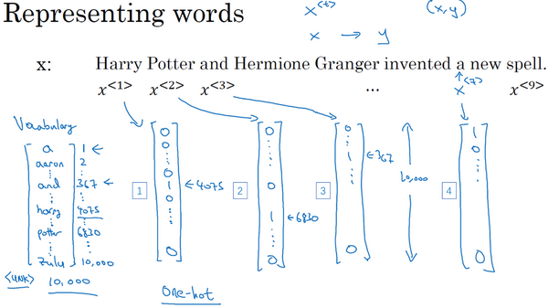
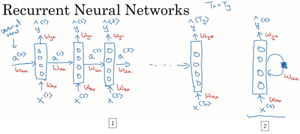
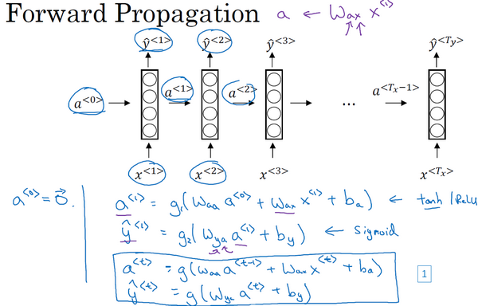
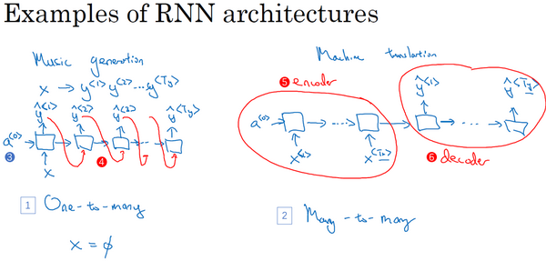
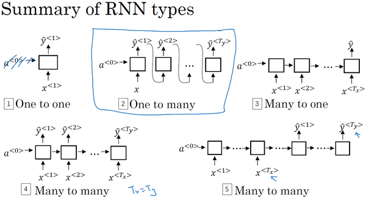
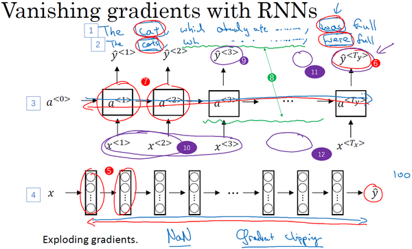
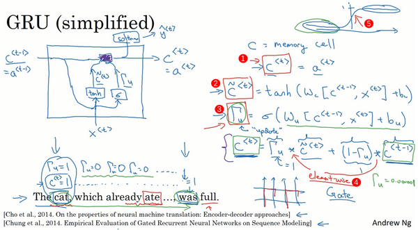
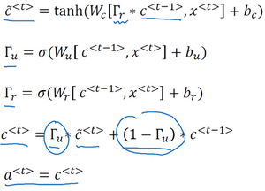
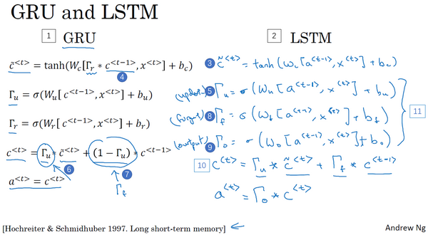
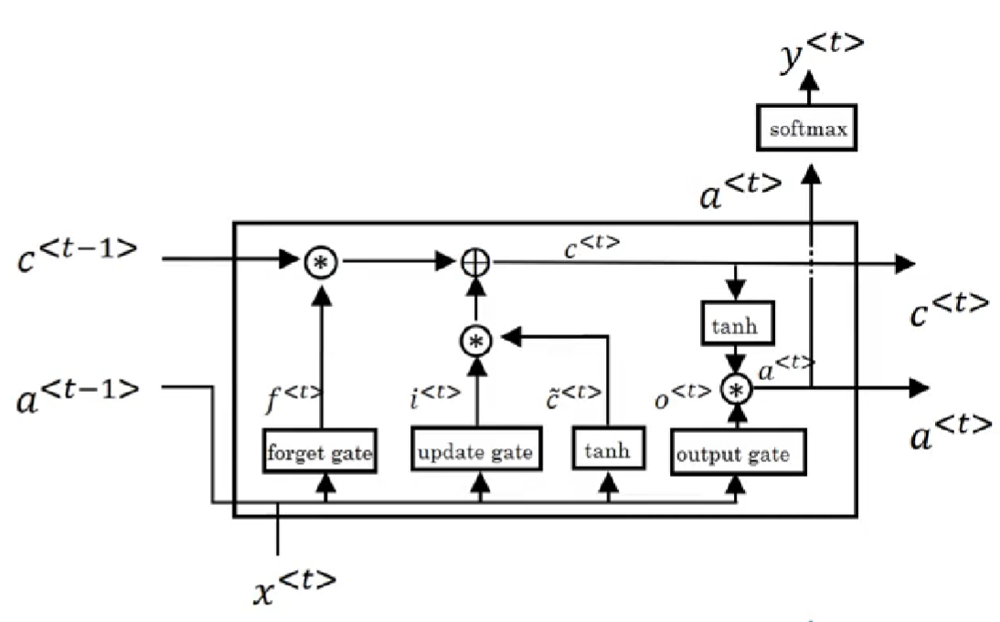

# 序列模型Sequence model

## 循环序列模型 Recurrent Neural Network

序列数据sequence data

语音识别： 音频->句子

### 符号定义

#### 输入与输出的表示

案例：Harry Potter and Herminoe Granger invented a new spell.检测单词是否是人名的一部分。

input X：Harry Potter and Herminoe Granger invented a new spell.

- 输入数据是9个单词组成的序列，所以最终我们会有9个特征集和来表示这9个单词，并按序列中的位置进行索引，$x^{<1>}$、$x^{<2>}$等等一直到$x^{<9>}$来索引不同的位置，我将用$x^{<t>}$来索引这个序列的中间位置。意味着它们是时序序列，但不论是否是时序序列，我们都将用 t 来索引序列中的位置。
- 输出数据也是一样，我们还是用$y^{<1>}$、$y^{<2>}$等等一直到$y^{<9>}$来表示输出数据。同时我们用$T_x$来表示输入序列的长度，这个例子中输入是9个单词，所以。我们用$T_x=9$来表示输出序列的长度。在这个例子里$T_x=T_y$，上个视频里你知道$T_x$和$T_y$可以有不同的值。

- 用$x^{(i)}$来表示第i个训练样本，所以为了指代第t个元素，或者说是训练样本 i 的序列中第 t 个元素用$x^{(i)<t>}$这个符号来表示。如果$T_x$是序列长度，那么你的训练集里不同的训练样本就会有不同的长度，所以$T_x^{(i)}$就代表第 i 个训练样本的输入序列长度。同样$y^{(i)<t>}$代表第 i 个训练样本中第 t 个元素，$T_y^{(i)}$就是第 i 个训练样本的输出序列的长度。

#### 词典

序列中单独的单词如何表示：**构建词典**

词典：汇聚了所有的单词，按序号排序。

构建词典：遍历训练集，找出前N个使用频率最高的常用词，然后使用one-hot数组的方法来进行表示。即$x^{<t>}$是一个one-hot向量，只有一个值是1指明位置，其他全0。

不在词典中的单词用**< UNK >**做标记

### Recurrent Neural Network Model

#### 不使用典型的深度学习网络

缺点：

- 输入和输出数据在不同例子中可以有不同的长度，不是所有的例子都有着同样输入长度或是同样输出长度的。即使每个句子都有最大长度，也许你能够填充（**pad**）或零填充（**zero pad**）使每个输入语句都达到最大长度，这样的话网络适用性有点差。
- 单纯的神经网络结构，它并不共享从文本的不同位置上学到的特征。具体来说，如果神经网络已经学习到了在位置1出现的**Harry**可能是人名的一部分，那么如果**Harry**出现在其他位置，却无法识别。
- 输入是高维度的ont-hot数组，会产生非常庞大的输入层。

一个好的模型表达可以大量的减少所需要的参数数量。

#### Recurrent Neural Network

- $a^{<i>}$表示传输到下一节点的激活值。
  - 要开始整个流程，在零时刻需要构造一个激活值，这通常是零向量。有些研究人员会随机用其他方法初始化，不过使用零向量作为零时刻的伪激活值是最常见的选择，因此我们把它输入神经网络。
- $W_{ax}$表示从输入x到隐藏层连接的一系列参数，每个时间步使用的都是相同的参数$W_{ax}$
- 激活值也就是水平联系是由参数$W_{aa}$决定的，同时每一个时间步都使用相同的参数$W_{aa}$ ,
-  同样的输出结果由$W_{ya}$决定。

这个结构使得所有先前决定的决策都能为后来遇到的x进行判断时做参考。

**优点是考虑了之前的信息，缺点是没有考虑后面的信息。**

举例：如果给定了这个句子，“Teddy Roosevelt was a great President.”，为了判断Teddy是否是人名的一部分，仅仅知道句中前两个词是完全不够的，还需要知道句中后部分的信息，这也是十分有用的，因为句子也可能是这样的，“Teddy bears are on sale!”。因此如果只给定前三个单词，是不可能确切地知道Teddy是否是人名的一部分，第一个例子是人名，第二个例子就不是，所以你不可能只看前三个单词就能分辨出其中的区别。

> 前向传播
>

开始先输入$a^{<0>}$，它是一个零向量。接着就是前向传播过程，先计算激活值$a^{<1>}$，然后再计算$y^{<1>}$。

$a^{<1>}=g_1(W_{aa}a^{<0>}+W_{ax}x^{<1>}+b_a)$

$\hat{y}^{<1>}=g_2(W_{ya}a^{<1>}+b_y)$

其中g1,g2是激活函数，经常是**tanh**，不过有时候也会用**ReLU**，但是**tanh**是更通常的选择。

在一般情况时候，t 时刻有：

$a^{<t>}=g_1(W_{aa}a^{<t-1>}+W_{ax}x^{<t>}+b_a)$

$\hat{y}^{<t>}=g_2(W_{ya}a^{<t>}+b_y)$

> 反向传播（通过时间 t ）

单个损失函数：使用交叉熵

$L^{<t>}(\hat{y}^{<t>},y^{<t>})=-y^{<t>}log\hat{y}^{<t>}-(1-y^{<t>})log(1-\hat{y}^{<t>})$

整个序列的损失函数：把每个单独时间步的损失函数都加起来

$L(\hat{y},y)=\sum _{t=1}^{T_x}{L^{<t>}(\hat{y}^{<t>},y^{<t>})}$

#### 不同类型的RNN

一对多结构one-to-many：一个输入对应多个输出

多对多结构many-to-many：多个输入对应多个输出

- 当输入输出长度不同的时候就产生了上述的编码器encoder/解码器decoder结构
  - 编码器读取整个句子
  - 解码器加工输出	

多对一结构many-to-one：多个输入对应一个输出

总结：

### 语言模型Language Modelling与序列生成Sequence generation

#### 语言模型Language Modelling

对产生的不同输出进行可能性（概率）计算，比较概率大小以选择更相似的结果输出。

举个例子，一个语音识别模型可能算出第一句话的概率是$P(The\ apple\ and\ pair\ salad. )=3.2\times 10^{-13}$，而第二句话的概率是$P(The\ apple\ and\ pear\ salad. )=5.7\times 10^{-10}$

，比较这两个概率值，显然我说的话更像是第二种，因为第二句话的概率比第一句高出1000倍以上，这就是为什么语音识别系统能够在这两句话中作出选择。

所以语言模型所做的就是，它会告诉你某个特定的句子它出现的概率是多少，根据我所说的这个概率，假设你随机拿起一张报纸，打开任意邮件，或者任意网页或者听某人说下一句话，并且这个人是你的朋友，这个你即将从世界上的某个地方得到的句子会是某个特定句子的概率是多少，例如“**the apple and pear salad**”。它是两种系统的基本组成部分，一个刚才所说的语音识别系统，还有机器翻译系统，它要能正确输出最接近的句子。而语言模型做的最基本工作就是输入一个句子，准确地说是一个文本序列，$y^{<1>},y^{<2>}一直到y^{<T_y>}$。对于语言模型来说，用 y 来表示这些序列比用 x 来表示要更好，然后语言模型会估计某个句子序列中各个单词出现的可能性。

> 建立语言模型

为了使用**RNN**建立出这样的模型，你首先需要一个训练集，包含一个很大的英文文本语料库（**corpus**）或者其它的语言，你想用于构建模型的语言的语料库。语料库是自然语言处理的一个专有名词，意思就是很长的或者说数量众多的英文句子组成的文本。

第一件事就是将这个句子标记化，意思就是像之前视频中一样，建立一个字典，然后将每个单词都转换成对应的**one-hot**向量，也就是字典中的索引。

第二是你要定义句子的结尾，一般的做法就是增加一个额外的标记，叫做**EOS**（上图编号1所示），它表示句子的结尾。**EOS**标记可以被附加到训练集中每一个句子的结尾，如果你想要你的模型能够准确识别句子结尾的话。

有一些词并不在你的字典里，比如说你的字典有10,000个词，10,000个最常用的英语单词。现在这个句，“**The Egyptian Mau is a bread of cat.**”其中有一个词**Mau**，它可能并不是预先的那10,000个最常用的单词，在这种情况下，你可以把**Mau**替换成一个叫做**UNK**的代表未知词的标志，我们只针对**UNK**建立概率模型，而不是针对这个具体的词**Mau**。

#### RNN模型搭建

使用“Cats average 15 hours of sleep a day.”这个句子来作为我们的运行样例，我将会画出一个RNN结构。通过前几个单词的输入来进行预测后面的句子。

- 在第0个时间步，你要计算激活项$a^{<1>}$，它是以$x^{<1>}$作为输入的函数，而$x^{<1>}$被设为全为0的集合，也就是0向量。在之前的按照惯例也设为0向量，于是要做的就是它会通过**softmax**进行一些预测来计算出第一个词可能会是什么，其结果就是$\hat{y}^{<1>}$，这一步其实就是通过一个**softmax**层来预测字典中的任意单词会是第一个词的概率，比如说第一个词是 a 的概率有多少，第一个词是**Aaron**的概率有多少，第一个词是**cats**的概率又有多少，就这样一直到**Zulu**是第一个词的概率是多少，还有第一个词是**UNK**（未知词）的概率有多少，还有第一个词是句子结尾标志的概率有多少，表示不必阅读。所以的输出是**softmax**的计算结果，它只是预测第一个词的概率，而不去管结果是什么。在我们的例子中，最终会得到单词**Cats**。所以**softmax**层输出10,000种结果，因为你的字典中有10,000个词，或者会有10,002个结果，因为你可能加上了未知词，还有句子结尾这两个额外的标志。

- 然后**RNN**进入下个时间步，在下一时间步中，在这步要做的是计算出第二个词$a^{<2>}$会是什么。现在我们依然传给它正确的第一个词，我们会告诉它第一个词就是**Cats**，也就是$\hat{y}^{<1>}$，告诉它第一个词就是**Cats**，这就是为什么$y^{<1>}=x^{<2>}$（上图编号2所示）。然后在第二个时间步中，输出结果同样经过**softmax**层进行预测，**RNN**的职责就是预测这些词的概率（上图编号3所示），而不会去管结果是什么，可能是b或者**arron**，可能是**Cats**或者**Zulu**或者**UNK**（未知词）或者**EOS**或者其他词，它只会考虑之前得到的词。所以在这种情况下，我猜正确答案会是**average**，因为句子确实就是**Cats average**开头的。

- 然后再进行**RNN**的下个时间步，现在要计算$a^{<3>}$。为了预测第三个词，也就是15，我们现在给它之前两个词，告诉它**Cats average**是句子的前两个词，所以这是下一个输入，$y^{<2>}=x^{<3>}$，输入**average**以后，现在要计算出序列中下一个词是什么，或者说计算出字典中每一个词的概率（上图编号4所示），通过之前得到的**Cats**和**average**，在这种情况下，正确结果会是15，以此类推。

- 一直到最后，没猜错的话，你会停在第9个时间步，然后把$x^{<9>}$也就是$y^{<8>}$传给它（上图编号5所示），也就是单词**day**，这里是$a^{<9>}$，它会输出$y^{<9>}$，最后的得到结果会是**EOS**标志，在这一步中，通过前面这些得到的单词，不管它们是什么，我们希望能预测出**EOS**句子结尾标志的概率会很高

- 所以RNN中的每一步都会考虑前面得到的单词，比如给它前3个单词（上图编号7所示），让它给出下个词的分布，这就是RNN如何学习从左往右地每次预测一个词。

- 单个损失函数：使用交叉熵

  $L^{<t>}(\hat{y}^{<t>},y^{<t>})=-y^{<t>}log\hat{y}^{<t>}-(1-y^{<t>})log(1-\hat{y}^{<t>})$

  整个序列的损失函数：把每个单独时间步的损失函数都加起来

  $L(\hat{y},y)=\sum _{t=1}^{T_x}{L^{<t>}(\hat{y}^{<t>},y^{<t>})}$

现在有一个新句子，它是$y^{<1>}$，$y^{<2>}$，$y^{<3>}$，为了简单起见，它只包含3个词（如上图所示），现在要计算出整个句子中各个单词的概率，方法就是第一个**softmax**层会告诉你$y^{<1>}$的概率（上图编号1所示），这也是第一个输出，然后第二个**softmax**层会告诉你$y^{<1>}$在考虑的情况下的概率$y^{<2>}$（上图编号2所示），然后第三个**softmax**层告诉你在考虑$y^{<1>}$和$y^{<2>}$的情况下$y^{<3>}$的概率（上图编号3所示），把这三个概率相乘，最后得到这个含3个词的整个句子的概率。

### 新序列采样

在你训练一个序列模型之后，要想了解到这个模型学到了什么，一种非正式的方法就是进行一次新序列采样，来看看到底应该怎么做。

记住一个序列模型模拟了任意特定单词序列的概率，我们要做的就是对这些概率分布进行采样来生成一个新的单词序列。

- 第一步要做的就是对你想要模型生成的第一个词进行采样，于是你输入$x^{<1>}=0$，$a^{<0>}=0$，现在你的第一个时间步得到的是所有可能的输出是经过softmax层后得到的概率，然后根据这个softmax的分布进行随机采样。Softmax分布给你的信息就是第一个词a的概率是多少，第一个词是aaron的概率是多少，第一个词是zulu的概率是多少，还有第一个词是UNK（未知标识）的概率是多少，这个标识可能代表句子的结尾，然后对这个向量使用例如numpy命令，np.random.choice（上图编号3所示），来根据向量中这些概率的分布进行采样，这样就能对第一个词进行采样了。

- 然后继续下一个时间步，记住第二个时间步需要$\hat{y}^{<1>}$作为输入，而现在要做的是把刚刚采样得到的$\hat{y}^{<1>}$放到$a^{<2>}$（上图编号4所示），作为下一个时间步的输入，所以不管你在第一个时间步得到的是什么词，都要把它传递到下一个位置作为输入，然后**softmax**层就会预测$\hat{y}^{<2>}$是什么。举个例子，假如说对第一个词进行抽样后，得到的是**The**，**The**作为第一个词的情况很常见，然后把**The**当成$x^{<2>}$，现在$x^{<2>}$就是$\hat{y}^{<1>}$，现在你要计算出在第一词是**The**的情况下，第二个词应该是什么（上图编号5所示），然后得到的结果就是$\hat{y}^{<2>}$，然后再次用这个采样函数来对$\hat{y}^{<2>}$进行采样。

- 然后再到下一个时间步，无论你得到什么样的用**one-hot**码表示的选择结果，都把它传递到下一个时间步，然后对第三个词进行采样。不管得到什么都把它传递下去，一直这样直到最后一个时间步。

  - 那么你要怎样知道一个句子结束了呢？方法之一就是，如果代表句子结尾的标识在你的字典中，你可以一直进行采样直到得到**EOS**标识（上图编号6所示），这代表着已经抵达结尾，可以停止采样了。另一种情况是，如果你的字典中没有这个词，你可以决定从20个或100个或其他个单词进行采样，然后一直将采样进行下去直到达到所设定的时间步。不过这种过程有时候会产生一些未知标识（上图编号7所示），如果你要确保你的算法不会输出这种标识，你能做的一件事就是拒绝采样过程中产生任何未知的标识，一旦出现就继续在剩下的词中进行重采样，直到得到一个不是未知标识的词。如果你不介意有未知标识产生的话，你也可以完全不管它们。

  

这就是你如何从你的**RNN**语言模型中生成一个随机选择的句子。直到现在我们所建立的是**基于词汇**的**RNN**模型，意思就是字典中的词都是英语单词（下图编号1所示）。

还可以构建一个**基于字符**的**RNN**结构，在这种情况下，你的字典仅包含从**a**到**z**的字母，可能还会有空格符，如果你需要的话，还可以有数字0到9，如果你想区分字母大小写，你可以再加上大写的字母，你还可以实际地看一看训练集中可能会出现的字符，然后用这些字符组成你的字典

建立一个基于字符的语言模型，比起基于词汇的语言模型，你的序列$\hat{y}^{<1>}$，$\hat{y}^{<2>}$，$\hat{y}^{<3>}$在你的训练数据中将会是单独的字符，而不是单独的词汇。所以对于前面的例子来说，那个句子（上图编号3所示），“**Cats average 15 hours of sleep a day.**”，在该例中**C**就是$\hat{y}^{<1>}$，**a**就是$\hat{y}^{<2>}$，**t**就是$\hat{y}^{<3>}$，空格符就是$\hat{y}^{<4>}$等等。

> 基于字符型语言模型VS基于词汇型语言模型

- 基于字符型语言模型：
  - 优点就是你不必担心会出现未知的标识，例如基于字符的语言模型会将**Mau**这样的序列也视为可能性非零的序列。
  - 缺点就是你最后会得到太多太长的序列，大多数英语句子只有10到20个的单词，但却可能包含很多很多字符。所以基于字符的语言模型在捕捉句子中的依赖关系也就是句子较前部分如何影响较后部分不如基于词汇的语言模型那样可以捕捉长范围的关系，并且基于字符的语言模型训练起来计算成本比较高昂。

- 基于词汇型语言模型：
  - 对于基于词汇的语言模型，如果**Mau**不在字典中，你只能把它当作未知标识**UNK**。

### RNN模型的梯度消失问题

> 长期依赖效应（句子中）

假如看到这个句子（上图编号1所示），“**The cat, which already ate ……, was full.**”，前后应该保持一致，因为**cat**是单数，所以应该用**was**。“**The cats, which ate ……, were full.**”（上图编号2所示），**cats**是复数，所以用**were**。这个例子中的句子有长期的依赖，最前面的单词对句子后面的单词有影响。

> RNN模型不擅长捕获长期依赖效应

但是我们目前见到的基本的**RNN**模型（上图编号3所示的网络模型），**不擅长捕获这种长期依赖效应**。

之前学习的深度网络讨论了梯度消失的问题。比如说一个很深很深的网络（上图编号4所示），100层，甚至更深，对这个网络从左到右做前向传播然后再反向传播。我们知道如果这是个很深的神经网络，从输出得到的梯度很难传播回去，很难影响靠前层的权重，很难影响前面层（编号5所示的层）的计算。

**RNN具有同样的问题**，首先从左到右前向传播，然后反向传播。但是反向传播会很困难，因为同样的梯度消失的问题，后面层的输出误差（上图编号6所示）很难影响前面层（上图编号7所示的层）的计算。这就意味着，实际上很难让一个神经网络能够意识到它要记住看到的是单数名词还是复数名词，然后在序列后面生成依赖单复数形式的was或者were。而且在英语里面，这中间的内容（上图编号8所示）可以任意长，对吧？所以你需要长时间记住单词是单数还是复数，这样后面的句子才能用到这些信息。也正是这个原因，所以基本的RNN模型会有很多局部影响，意味着这个输出$\hat{y}^{<3>}$主要受附近的值（上图编号10所示）的影响，上图编号11所示的一个数值主要与附近的输入（上图编号12所示）有关，上图编号6所示的输出，基本上很难受到序列靠前的输入（上图编号10所示）的影响，这是因为不管输出是什么，不管是对的，还是错的，这个区域都很难反向传播到序列的前面部分，也因此网络很难调整序列前面的计算。这是基本的**RNN**算法的一个缺点

> RNN的梯度爆炸

在讲很深的神经网络时，我们也提到了梯度爆炸，我们在反向传播的时候，随着层数的增多，梯度不仅可能指数型的下降，也可能指数型的上升。事实上梯度消失在训练**RNN**时是首要的问题，尽管梯度爆炸也是会出现，但是梯度爆炸很明显，因为指数级大的梯度会让你的参数变得极其大，以至于你的网络参数崩溃。所以梯度爆炸很容易发现，因为参数会大到崩溃，你会看到很多**NaN**，或者不是数字的情况，这意味着你的网络计算出现了数值溢出。如果你发现了梯度爆炸的问题，一个解决方法就是用梯度修剪。梯度修剪的意思就是观察你的梯度向量，如果它大于某个阈值，缩放梯度向量，保证它不会太大，这就是通过一些最大值来修剪的方法。所以如果你遇到了梯度爆炸，如果导数值很大，或者出现了**NaN**，就用梯度修剪，这是相对比较鲁棒的，这是梯度爆炸的解决方法。

### GRU单元（Gated Recurrent Unit）门控制循环单元

GRU的作用：改变RNN隐藏层，使其可以更好地捕捉深层连接，并改善了梯度消失问题

RNN的循环单元：

我再引用上个视频中你已经见过的这个句子，“**The cat, which already ate……, was full.**”，你需要记得猫是单数的，为了确保你已经理解了为什么这里是**was**而不是**were**，“**The cat was full.**”或者是“**The cats were full**”。当我们从左到右读这个句子，**GRU**单元将会有个新的变量称为 c ，代表细胞（**cell**），即记忆细胞（下图编号1所示）。

记忆细胞的作用是提供了记忆的能力，比如说一只猫是单数还是复数，所以当它看到之后的句子的时候，它仍能够判断句子的主语是单数还是复数。于是在时间 t 处，有记忆细胞$c^t$ ,然后我们看的是，**GRU**实际上输出了激活值 $a^t$ , $a^t=c^t$ ,于是我们想要使用不同的符号和来表示记忆细胞的值和输出的激活值，即使它们是一样的。我现在使用这个标记是因为当我们等会说到**LSTMs**的时候，这两个会是不同的值，但是现在对于**GRU**，二者没有区别。

在每个时间步，我们将用一个候选值重写记忆细胞，即$\tilde{c}^t$的值，所以它就是个候选值，替代了$c^t$的值。然后我们用**tanh**激活函数来计算，$\tilde{c}^t=tanh(W_c[c^{<t-1>},x^t]+b_c)$。

重点来了，在**GRU**中真正重要的思想是我们有一个门，我先把这个门叫做$\Gamma_u$ ，这是一个0到1之间的值，实际上这个值是把这个式子$\Gamma_u=\sigma(W_u[c^{<t-1>},x^t]+b_u)$带入**sigmoid**函数得到的，我们还记得**sigmoid**函数是上图编号5所示这样的，它的输出值总是在0到1之间，对于大多数可能的输入，**sigmoid**函数的输出总是非常接近0或者非常接近1。在这样的直觉下，可以想到在大多数的情况下非常接近0或1。然后这个字母**u**表示“**update**”，我选了字母是因为它看起来像门。还有希腊字母**G**，**G**是门的首字母，所以**G**表示门。

然后**GRU**的关键部分就是上图编号3所示的等式，我们刚才写出来的用$\tilde{c}$更新 c 的等式。然后门决定是否要真的更新它。于是我们这么看待它，记忆细胞 $c^t$ 将被设定为0或者1，这取决于你考虑的单词在句子中是单数还是复数，因为这里是单数情况，所以我们先假定它被设为了1，或者如果是复数的情况我们就把它设为0。然后**GRU**单元将会一直记住$c^t$的值，直到上图编号7所示的位置，$c^t$的值还是1，这就告诉它，噢，这是单数，所以我们用**was**。于是门，即的作用就是决定什么时候你会更新这个值，特别是当你看到词组**the cat**，即句子的主语猫，这就是一个好时机去更新这个值。然后当你使用完它的时候，“**The cat, which already ate……, was full.**”，然后你就知道，我不需要记住它了，我可以忘记它了。

自造一个存储长期信息的东西，适当时候就拿出来用。

所以我们接下来要给**GRU**用的式子就是$c^t=\Gamma_u*\tilde{c}^t+(1-\Gamma_u)*c^{<t-1>}$

这个式子的意思是：当$\Gamma_u=1$时，执行$c^t=\tilde{c}^t$将门值设为1（上图编号2所示），然后往前再更新这个值。对于所有在这中间的值，你应该把门的值设为0，即$\Gamma_u=0$, 意思就是说不更新它，就用旧的值$c^{t}=c^{<t-1>}$。

甚至你从左到右扫描这个句子，当门值为0的时候（上图编号3所示，中间$\Gamma_u=0$一直为0，表示一直不更新），就是说不更新它的时候，不要更新它，就用旧的值，也不要忘记这个值是什么，这样即使你一直处理句子到上图编号4所示，$c^{t}$应该会一直等$c^{t-1}，于是它仍然记得猫是单数的。

**GRU**单元，它的优点就是通过门决定，当你从左（上图编号10所示）到右扫描一个句子的时候，这个时机是要更新某个记忆细胞，还是不更新。直到你到你真的需要使用记忆细胞的时候（上图编号12所示），这可能在句子之前就决定了。因为sigmoid的值，现在因为门很容易取到0值，只要这个值是一个很大的负数，再由于数值上的四舍五入，上面这些门大体上就是0，或者说非常非常非常接近0。所以在这样的情况下，这个更新式子（上图编号13所示的等式）就会变成$c^{t}=c^{<t-1>}$ 这非常有利于维持细胞的值。因为$\Gamma_u$很接近0，这就是说$c^t$几乎就等于$c^{<t-1>}$，而且$c^t$的值也很好地被维持了，即使经过很多很多的时间步（上图编号14所示）。这就是缓解梯度消失问题的关键，因此允许神经网络运行在非常庞大的依赖词上，比如说**cat**和**was**单词即使被中间的很多单词分割开。

当然在实际应用中$\Gamma_u$不会真的等于0或者1，有时候它是0到1的一个中间值（上图编号5所示），但是这对于直观思考是很方便的，就把它当成确切的0，完全确切的0或者就是确切的1。元素对应的乘积做的就是告诉**GRU**单元哪个记忆细胞的向量维度在每个时间步要做更新，所以你可以选择保存一些比特不变，而去更新其他的比特。比如说你可能需要一个比特来记忆猫是单数还是复数，其他比特来理解你正在谈论食物，因为你在谈论吃饭或者食物，然后你稍后可能就会谈论“**The cat was full.**”，你可以每个时间点只改变一些比特。

> 完整的GRU单元

1. $\tilde{c}^{<t>}=tanh(W_c[\Gamma_r*c^{<t-1>},x^{<t>}]+b_c)$ , r代表相关性，$\Gamma_r$表示下一个$c^t$的候选值$\tilde{c}^t$跟$c^{<t-1>}$的相似程度。计算这个门$\Gamma_r$需要额外的参数。
2. $\Gamma_u=\sigma(W_u[c^{<t-1>},x^t]+b_u)$
3. $\Gamma_r=\sigma(W_r[c^{<t-1>},x^t]+b_c)$
4. $c^t=\Gamma_u*\tilde{c}^t+(1-\Gamma_u)*c^{<t-1>}$

### 长短期记忆网络**LSTM**（long short term memory）

**GRU**（门控循环单元）能够让你可以在序列中学习非常深的连接。其他类型的单元也可以让你做到这个，比如**LSTM**即长短时记忆网络，甚至比**GRU**更加有效。

对于GRU：

1. $a^{<t>}=c^{<t>}$
2. 更新门the update gate $\Gamma_u$
3. 相关门the relevance gate $\Gamma_r$
4. $\tilde{c}^<t>$是代替记忆细胞的候选值，后我们使用更新门来决定是否要用候选值代替更新。

LSTM长短期记忆网络：

1. $\tilde{c}^{<t>}=tanh(W_c[c^{<t-1>},x^{<t>}]+b_c)$
2. $\Gamma_u=\sigma(W_u[c^{<t-1>},x^t]+b_u)$ 更新门
3. $\Gamma_f=\sigma(W_f[c^{<t-1>},x^t]+b_f)$ 遗忘门
4. $\Gamma_o=\sigma(W_o[c^{<t-1>},x^t]+b_o)$ 输出门
5. $c^t=\Gamma_u*\tilde{c}^t+\Gamma_f*c^{<t-1>}$
6. $a^{<t>}=\Gamma_o*c^{<t>}$

最常用的版本可能是门值不仅取决于$a^{<t-1>}$和$x^{<t>}$,有时候也可以偷窥一下$c^{<t-1>}$的值，这叫做“窥视孔连接”（**peephole connection**）。

###  双向循环神经网络（Bidirectional **RNN**）

这个模型可以让你在序列的某点处不仅可以获取之前的信息，还可以获取未来的信息.

下面解释双向**RNN**的工作原理。为了简单，我们用四个输入或者说一个只有4个单词的句子，这样输入只有4个

首先进行正向计算，然后开始反向计算重新预测一遍。

### 深层循环神经网络（Deep **RNN**s）

这是我们一直见到的标准的**RNN**（上图编号3所示方框内的**RNN**），只是我把这里的符号稍微改了一下，不再用原来的$a^{<0>}$表示0时刻的激活值了，而是用$a^{[1]<0>}$来表示第一层（上图编号4所示），所以我们现在用$a^{[l]<t>}$来表示第l层的激活值，这个<t>表示第个时间点，这样就可以表示。第一层第一个时间点的激活值$a^{[1]<1>}$，这（$a^{[1]<2>}$）就是第一层第二个时间点的激活值。然后我们把这些（上图编号4方框内所示的部分）堆叠在上面，这就是一个有三个隐层的新的网络。

