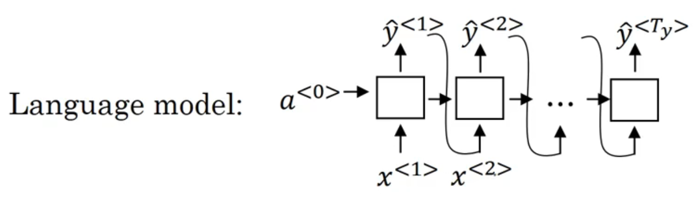
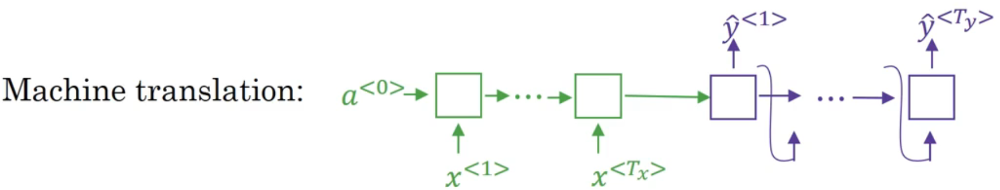
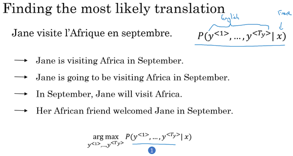
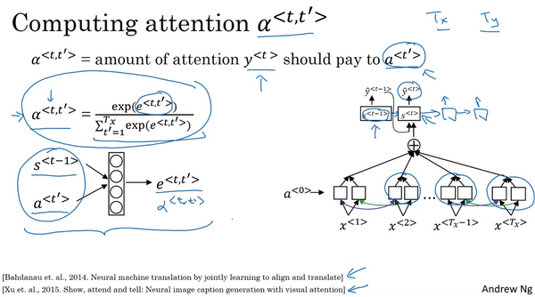
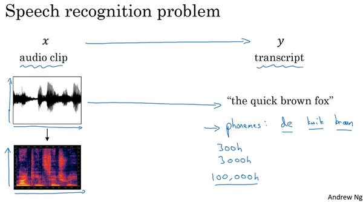

# 基础模型（Basic Models）

**sequence to sequence**模型

集束搜索**Beam search**

注意力模型**Attention Model**

一直到最后的音频模型

下面介绍**sequence to sequence**模型：

任务：想通过输入一个法语句子，比如这句 “**Jane visite I'Afrique en septembre.**”，将它翻译成一个英语句子，“**Jane is visiting Africa in September.**”。

使用$x^{<i>}$表示输入。使用$y^{<j>}$表示输入。

那么，如何训练出一个新的网络来输入序列x和输出序列y呢？

- encoder编码器（左侧1）：首先，我们先建立一个网络，这个网络叫做编码网络**encoder network**（上图编号1所示），它是一个**RNN**的结构， **RNN**的单元可以是**GRU** 也可以是**LSTM**。每次只向该网络中输入一个法语单词，将输入序列接收完毕后，这个**RNN**网络会输出一个向量来代表这个输入序列。
- decoder解码器（右侧2）：之后你可以建立一个解码网络，我把它画出来（上图编号2所示），它以编码网络的输出作为输入，编码网络是左边的黑色部分（上图编号1所示），之后它可以被训练为每次输出一个翻译后的单词，一直到它输出序列的结尾或者句子结尾标记，这个解码网络的工作就结束了。和往常一样我们把每次生成的标记都传递到下一个单元中来进行预测，就像之前用语言模型合成文本时一样。

深度学习在近期最卓越的成果之一就是这个模型确实有效，在给出足够的法语和英语文本的情况下，如果你训练这个模型，通过输入一个法语句子来输出对应的英语翻译，这个模型将会非常有效。这个模型简单地用一个编码网络来对输入的法语句子进行编码，然后用一个解码网络来生成对应的英语翻译。

还有一个与此类似的结构被用来做图像描述，给出一张图片，比如这张猫的图片（上图编号1所示），它能自动地输出该图片的描述，一只猫坐在椅子上，那么你如何训练出这样的网络？通过输入图像来输出描述，像这个句子一样。

方法如下，在之前的卷积网络课程中，你已经知道了如何将图片输入到卷积神经网络中，比如一个预训练的**AlexNet**结构（上图编号2方框所示），然后让其学习图片的编码，或者学习图片的一系列特征。现在幻灯片所展示的就是**AlexNet**结构，我们去掉最后的**softmax**单元（上图编号3所示），这个预训练的**AlexNet**结构会给你一个4096维的特征向量，向量表示的就是这只猫的图片，所以这个预训练网络可以是图像的编码网络。现在你得到了一个4096维的向量来表示这张图片，接着你可以把这个向量输入到**RNN**中（上图编号4方框所示），RNN要做的就是生成图像的描述，每次生成一个单词，这和我们在之前将法语译为英语的机器翻译中看到的结构很像，现在你输入一个描述输入的特征向量，然后让网络生成一个输出序列，或者说一个一个地输出单词序列。

事实证明在图像描述领域，这种方法相当有效，特别是当你想生成的描述不是特别长时。

现在你知道了基本的**seq2seq**模型是怎样运作的，以及**image to sequence**模型或者说图像描述模型是怎样运作的。不过这两个模型运作方式有一些不同，主要体现在如何用语言模型合成新的文本，并生成对应序列的方面。

# 选择最可能的句子Picking the most likely sentence

可以把机器翻译当做一个特殊的语言模型

语言模型可以预测生成的句子的可能性。

上图机器翻译模型中，绿色代表编码器部分，紫色代表解码器部分。而decoder部分极其相似于Language model。

区别在于Language model以$a^{<0>}$作为输入，而机器翻译模型使用编码器从输入中提取出的特征作为输入，而不是从零开始。因此称之为conditional language model。输出的是基于输入语句条件下的不同翻译后句子的可能性。

这个模型可以表示为$P(y^{<1>},y^{<2>},...,y^{<T_y>}|x)$

- x为输入法语句子

- $y^{<i>}$为输出翻译语句对应的可能性，这个可能性是基于输入x句子上的

  

显然你不想让模型随机地进行输出，所以当你使用这个模型来进行机器翻译时，你并不是从得到的分布中进行随机取样，而是你要找到一个英语句子y（上图编号1所示），使得条件概率最大化。

所以在开发机器翻译系统时，你需要做的一件事就是想出一个算法，用来找出合适的y值，使得该项最大化，而解决这种问题最通用的算法就是束搜索(**Beam Search**)。

不过在了解束搜索之前，你可能会问一个问题，为什么不用贪心搜索(**Greedy Search**)呢？贪心搜索是一种来自计算机科学的算法，生成第一个词的分布以后，它将会根据你的条件语言模型挑选出最有可能的第一个词进入你的机器翻译模型中，在挑选出第一个词之后它将会继续挑选出最有可能的第二个词，然后继续挑选第三个最有可能的词，这种算法就叫做贪心搜索。

> 贪心搜索策略为什么不适合

第一串（上图编号1所示）翻译明显比第二个（上图编号2所示）好，所以我们希望机器翻译模型会说第一个句子的$P(y|x)$比第二个句子要高，第一个句子对于法语原文来说更好更简洁，虽然第二个也不错，但是有些啰嗦，里面有很多不重要的词。但如果贪心算法挑选出了"**Jane is**"作为前两个词，因为在英语中**going**更加常见，于是对于法语句子来说"**Jane is going**"相比"**Jane is visiting**"会有更高的概率作为法语的翻译，所以很有可能如果你仅仅根据前两个词来估计第三个词的可能性，得到的就是**going**，最终你会得到一个欠佳的句子，在$P(y|x)$模型中这不是一个最好的选择。

总结：考虑到几个词汇进行组合成短语的情况下，贪心搜索逐词找最假不是最好的解决方法。

最后总结一下，在本视频中，你看到了机器翻译是如何用来解决条件语言模型问题的，这个模型和之前的语言模型一个主要的区别就是，相比之前的模型随机地生成句子，在该模型中你要找到最有可能的英语句子，最可能的英语翻译，但是可能的句子组合数量过于巨大，无法一一列举，所以我们需要一种合适的搜索算法。

# 集束搜索Beam Search

对于机器翻译来说，给定输入，比如法语句子，你不会想要输出一个随机的英语翻译结果，你想要一个最好的，最可能的英语翻译结果。对于语音识别也一样，给定一个输入的语音片段，你不会想要一个随机的文本翻译结果，你想要最好的，最接近原意的翻译结果，集束搜索就是解决这个最常用的算法。

“**Jane visite l'Afrique en Septembre.**”（法语句子），我们希望翻译成英语，"**Jane is visiting Africa in September**".（英语句子），集束搜索算法首先做的就是挑选要输出的英语翻译中的第一个单词。这里我列出了10,000个词的词汇表（下图编号1所示），为了简化问题，我们忽略大小写，所有的单词都以小写列出来。在集束搜索的第一步中我用这个网络部分，绿色是编码部分（下图编号2所示），紫色是解码部分（下图编号3所示），来评估第一个单词的概率值，给定输入序列x，即法语作为输入，第一个输出y的概率值是多少。

贪婪算法只会挑出最可能的那一个单词，然后继续。而集束搜索则会考虑多个选择，集束搜索算法会有一个参数**B**，叫做集束宽（**beam width**）。在这个例子中我把这个集束宽设成3，这样就意味着集束搜索不会只考虑一个可能结果，而是一次会考虑3个，比如对第一个单词有不同选择的可能性，最后找到**in**、**jane**、**september**，是英语输出的第一个单词的最可能的三个选项，然后集束搜索算法会把结果存到计算机内存里以便后面尝试用这三个词。如果集束宽设的不一样，如果集束宽这个参数是10的话，那么我们跟踪的不仅仅3个，而是10个第一个单词的最可能的选择。所以要明白，为了执行集束搜索的第一步，你需要输入法语句子到编码网络，然后会解码这个网络，这个**softmax**层（上图编号3所示）会输出10,000个概率值，得到这10,000个输出的概率值，取前三个存起来。(贪心算法的升级版？)

让我们看看集束搜索算法的第二步，已经选出了**in**、**jane**、**september**作为第一个单词三个最可能的选择，集束算法接下来会针对每个第一个单词考虑第二个单词是什么，单词**in**后面的第二个单词可能是**a**或者是**aaron**，我就是从词汇表里把这些词列了出来，或者是列表里某个位置，**september**，可能是列表里的 **visit**，一直到字母**z**，最后一个单词是**zulu**（下图编号1所示）。

为了评估第二个词的概率值，我们用这个神经网络的部分，绿色是编码部分（上图编号2所示），而对于解码部分，当决定单词**in**后面是什么，别忘了解码器的第一个输出$y^{<1>}$，我把$y^{<1>}$设为单词**in**（上图编号3所示），然后把它喂回来，这里就是单词**in**（上图编号4所示），因为它的目的是努力找出第一个单词是**in**的情况下，第二个单词是什么。这个输出就是$y^{<2>}$（上图编号5所示），有了这个连接（上图编号6所示），就是这里的第一个单词**in**（上图编号4所示）作为输入，这样这个网络就可以用来评估第二个单词的概率了，在给定法语句子和翻译结果的第一个单词**in**的情况下。

集束宽为3，并且词汇表里有10,000个单词，那么最终我们会有3乘以10,000也就是30,000个可能的结果，因为这里（上图编号1所示）是10,000，这里（上图编号2所示）是10,000，这里（上图编号3所示）是10,000，就是集束宽乘以词汇表大小，你要做的就是评估这30,000个选择。按照第一个词和第二个词的概率，然后选出前三个，这样又减少了这30,000个可能性，又变成了3个，减少到集束宽的大小。假如这30,000个选择里最可能的是“**in September**”（上图编号4所示）和“**jane is**”（上图编号5所示），以及“**jane visits**”（上图编号6所示），画的有点乱，但这就是这30,000个选择里最可能的三个结果，集束搜索算法会保存这些结果，然后用于下一次集束搜索。

集束宽等于3，每一步我们都复制3个，同样的这种网络来评估部分句子和最后的结果，由于集束宽等于3，我们有三个网络副本（上图编号7所示），每个网络的第一个单词不同，而这三个网络可以高效地评估第二个单词所有的30,000个选择,从中选出3个。所以不需要初始化30,000个网络副本，只需要使用3个网络的副本就可以快速的评估**softmax**的输出，即$y^{<2>}$的10,000个结果。

每一步都生成三个最可能的结果，

# 注意力模型Attention Model

注意力模型：生成翻译时，翻译头部就不需要看整个句子，只需要关注对应的部分。

使用这个编码解码的构架（**a Encoder-Decoder architecture**）来完成机器翻译。当你使用**RNN**读一个句子，于是另一个会输出一个句子。我们要对其做一些改变，称为注意力模型（**the Attention Model**），并且这会使它工作得更好。注意力模型或者说注意力这种思想（**The attention algorithm, the attention idea**）已经是深度学习中最重要的思想之一，我们看看它是怎么运作的。

像这样给定一个很长的法语句子，在你的神经网络中，这个绿色的编码器要做的就是读整个句子，然后记忆整个句子，再在感知机中传递（**to read in the whole sentence and then memorize the whole sentences and store it in the activations conveyed her**）。而对于这个紫色的神经网络，即解码网络（**the decoder network**）将生成英文翻译，**Jane**去年九月去了非洲，非常享受非洲文化，遇到了很多奇妙的人，她回来就嚷嚷道，她经历了一个多棒的旅行，并邀请我也一起去。

人工翻译并不会通过读整个法语句子，再记忆里面的东西，然后从零开始，机械式地翻译成一个英语句子。而人工翻译，首先会做的可能是先翻译出句子的部分，再看下一部分，并翻译这一部分。看一部分，翻译一部分，一直这样下去。你会通过句子，一点一点地翻译，因为记忆整个的像这样的的句子是非常困难的。你在下面这个编码解码结构中，会看到它对于短句子效果非常好，但是对于长句子而言，比如说大于30或者40词的句子，它的表现就会变差。随着单词数量变化，短的句子会难以翻译，因为很难得到所有词。对于长的句子，效果也不好，因为在神经网络中，记忆非常长句子是非常困难的。在这个和下个视频中，你会见识到注意力模型，它翻译得很像人类，一次翻译句子的一部分。而且有了注意力模型，机器翻译系统的表现会像这个一样，因为翻译只会翻译句子的一部分，你不会看到这个有一个巨大的下倾（**huge dip**），这个下倾实际上衡量了神经网络记忆一个长句子的能力，这是我们不希望神经网络去做的事情。

使用双向RNN，为每个输入词生成特征。

使用另一个RNN作为输出。

这里不是用A来表示感知机，而是用S。

当开始翻译生成句子的首部时，当你尝试生成第一个词，即输出，那么我们应该看输入的法语句子的哪个部分？似乎你应该先看第一个单词，或者它附近的词。但是你别看太远了，比如说看到句尾去了。即注意力放在原句的前半部分而不是后边。

注意力机制为每个输入单元分配对应的注意力比重。所以注意力模型就会计算注意力权重（**a set of attention weights**），我们将用$a^{<1,1>}$来表示当你生成第一个词时你应该放多少注意力在这个第一块信息处。然后我们算第二个，这个叫注意力权重，它告诉我们当你$a^{<1,2>}$尝试去计算第一个词**Jane**时，我们应该花多少注意力在输入的第二个词上面。同理这里是$a^{<1,3>}$，接下去也同理。这些将会告诉我们，我们应该花多少注意力在记号为C的内容上。

对于翻译生成的第二个单词，我们将有一个新的隐藏状态$S^{<2>}$，我们也会用一个新的注意力权值集**(a new set of the attention weights**),我们将用$a^{<2,1>}$来告诉我们什么时候生成第二个词, 那么**visits**就会是第二个标签了(**the ground trip label**)。我们应该花多少注意力在输入的第一个法语词上。然后同理$a^{<2,2>}$，接下去也同理，我们应该花多少注意力在**visite**词上，我们应该花多少注意在词**l'Afique**上面。当然我们第一个生成的词**Jane**也会输入到这里，于是我们就有了需要花注意力的上下文。第二步，这也是个输入，然后会一起生成第二个词。

概括:

输出RNN输出一个词就对应一个RNN循环单元，这里每个单元的输入是C（注意力）和之前单元的生成结果，输出一个单词。C注意力是指，当前为了翻译输出这个单词，对原句输入x的每个单词分配不同的注意力比值以达到抓重点的效果，通过翻译每个单词对应原句不同的注意力部分达到更好的效果。每个RNN单元输出词对应的原句一系列的注意力都是不同的。然后RNN不断拓展每个单元生成一个词直到结束。

输入x+编码模型：双向RNN（每个单元中存放的是正反向计算的激活值），使用$a^{<t>}$同时表示正反向传播的激活值，即时间步 t 上的特征向量。同时使用$t'$表示时间步t代表的的法语单词。

输出序列S：

对于第一个RNN单元，输入上下文C，和初始输入$S^{<0>}$生成翻译的第一个单词。上下文C是注意力参数，即$x^{<1>}$对应的注意力参数$\alpha^{<1，1>}$,$x^{<2>}$对应的注意力参数$\alpha^{<1,2>}$….，注意力参数这告诉了我们生成第一个翻译单词的时候应该注意原句子中的哪些部分 。然后注意力权重的总和为1，最低是0完全不用关注。$\sum_{t'}\alpha^{<1,t'>}a^{t'}$,即每个单词的激活值乘以注意力权值求和。

在下一个RNN单元，会有新的注意力权值集合，产生新的上下文C，并参考上个单元的输出值。

那么 重点是：如何科学的获得注意力权值比较好？

$\alpha^{<t,t'>}$表示生成第t个翻译单词，应当分陪在原句子t’单词上的注意力权值。所有的权值求和值为1。

$\alpha^{<t,t'>}=\frac{exp(e^{t,t'})}{\sum^{T_x}_{t'=1}exp(e^{<t,t'>})}$

计算单元如上图所示，$s^{t-1}$表示上个RNN时间步的隐藏状态，

右侧是使用神经网络去得到注意力分配的函数，（把神经网络当成一个函数生成器）。

缺点：算法的复杂度是$O(n^3)$的。有a个输入单词，b个输出单词，注意力参数的个数就有x*y个。

# 语音识别（Speech recognition）

什么是语音视频问题呢？现在你有一个音频片段x（**an audio clip,x**），你的任务是自动地生成文本y。现在有一个音频片段，画出来是这样，该图的横轴是时间。一个麦克风的作用是测量出微小的气压变化，现在你之所以能听到我的声音，是因为你的耳朵能够探测到这些微小的气压变化，它可能是由你的扬声器或者耳机产生的，也就是像图上这样的音频片段，气压随着时间而变化。

这时我们希望一个语音识别算法（**a speech recognition algorithm**），通过输入这段音频，然后输出音频的文本内容。考虑到人的耳朵并不会处理声音的原始波形，而是通过一种特殊的物理结构来测量这些，不同频率和强度的声波。音频数据的常见预处理步骤，就是运行这个原始的音频片段，然后生成一个声谱图（**a spectrogram**），就像这样。同样地，横轴是时间，纵轴是声音的频率（**frequencies**），而图中不同的颜色，显示了声波能量的大小（**the amount of energy**），也就是在不同的时间和频率上这些声音有多大。通过这样的声谱图，或者你可能还听过人们谈到过伪空白输出（**the false blank outputs**），也经常应用于预处理步骤，也就是在音频被输入到学习算法之前，而人耳所做的计算和这个预处理过程非常相似。语音识别方面，最令人振奋的趋势之一就是曾经有一段时间，语音识别系统是用音位（**phonemes**）来构建的，也就是人工设计的基本单元（**hand-engineered basic units of cells**），如果用音位来表示"**the quick brown fox**"，我这里稍微简化一些，"**the**"含有"**th**"和"**e**"的音，而"**quick**"有"**k**" "**w**" "**i**" "**k**"的音，语音学家过去把这些音作为声音的基本单元写下来，把这些语音分解成这些基本的声音单元，而"**brown**"不是一个很正式的音位，因为它的音写起来比较复杂，不过语音学家（**linguists**）们认为用这些基本的音位单元（**basic units of sound called phonemes**）来表示音频（**audio**），是做语音识别最好的办法。不过在**end-to-end**模型中，我们发现这种音位表示法（**phonemes representations**）已经不再必要了，而是可以构建一个系统，通过向系统中输入音频片段（**audio clip**），然后直接输出音频的文本（**a transcript**），而不需要使用这种人工设计的表示方法。使这种方法成为可能的一件事就是用一个很大的数据集，所以语音识别的研究数据集可能长达300个小时，在学术界，甚至3000小时的文本音频数据集，都被认为是合理的大小。大量的研究，大量的论文所使用的数据集中，有几千种不同的声音，而且，最好的商业系统现在已经训练了超过1万个小时的数据，甚至10万个小时，并且它还会继续变得更大。在文本音频数据集中（**Transcribe audio data sets**）同时包含x和y，通过深度学习算法大大推进了语音识别的进程。那么，如何建立一个语音识别系统呢？

我们谈到了注意力模型，所以，一件你能做的事就是在横轴上，也就是在输入音频的不同时间帧上，你可以用一个注意力模型，来输出文本描述，如"**the quick brown fox**"，或者其他语音内容。