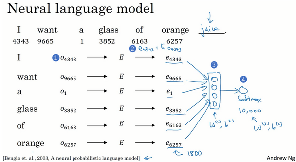
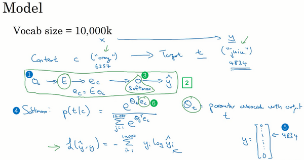
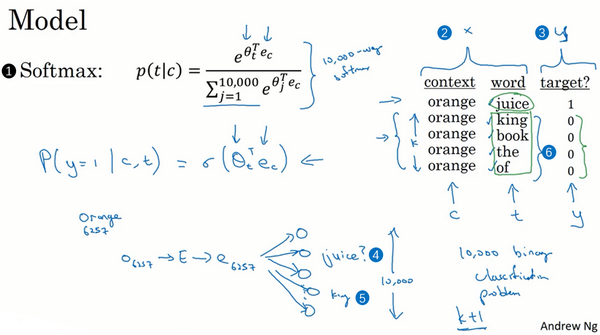
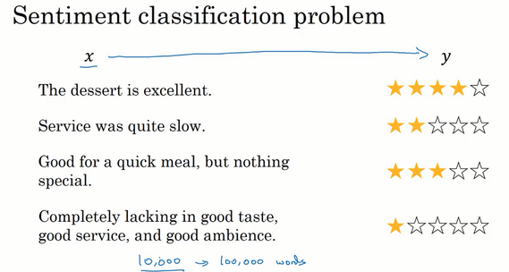
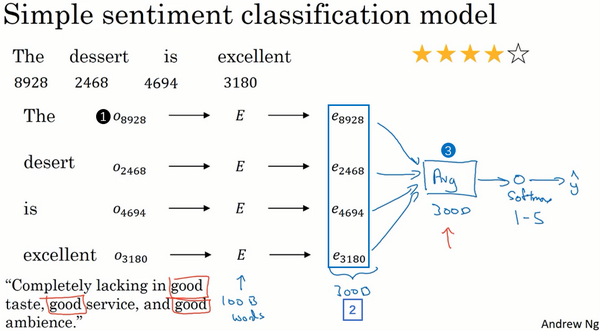
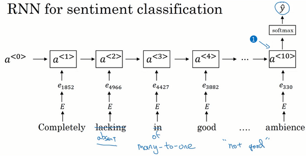

# 自然语言处理与词嵌入（Natural Language Processing and Word Embeddings）

词嵌入（**word embeddings**），这是语言表示的一种方式，可以让算法自动的理解一些类似的词，比如男人对女人，比如国王对王后，还有其他很多的例子。通过词嵌入的概念你就可以构建**NLP**应用了，即使你的模型标记的训练集相对较小。

## 词汇表征Word Representation

现在我们先开始讨论词汇表示，目前为止我们一直都是用词汇表来表示词，上周提到的词汇表，可能是10000个单词，我们一直用**one-hot**向量来表示词。比如如果**man**（上图编号1所示）在词典里是第5391个，那么就可以表示成一个向量，只在第5391处为1（上图编号2所示），我们用$O_{5391}$代表这个量，这里的$O$代表**one-hot**。接下来，如果**woman**是编号9853（上图编号3所示），那么就可以用$O_{9853}$来表示，这个向量只在9853处为1（上图编号4所示），其他为0，其他的词**king**、**queen**、**apple**、**orange**都可以这样表示出来这种表示方法的一大缺点就是它把每个词孤立起来，这样使得算法对相关词的泛化能力不强。

举个例子，假如你已经学习到了一个语言模型，当你看到“**I want a glass of orange ___**”，那么下一个词会是什么？很可能是**juice**。即使你的学习算法已经学到了“**I want a glass of orange juice**”这样一个很可能的句子，但如果看到“**I want a glass of apple ___**”，因为算法不知道**apple**和**orange**的关系很接近，就像**man**和**woman**，**king**和**queen**一样。所以算法很难从已经知道的**orange** **juice**是一个常见的东西，而明白**apple** **juice**也是很常见的东西或者说常见的句子。

这是因为任何两个**one-hot**向量的内积都是0，如果你取两个向量，比如**king**和**queen**，然后计算它们的内积，结果就是0。如果用**apple**和**orange**来计算它们的内积，结果也是0。很难区分它们之间的差别，因为这些向量内积都是一样的，所以无法知道**apple**和**orange**要比**king**和**orange**，或者**queen**和**orange**相似地多。

换一种表示方式会更好，如果我们不用**one-hot**表示，而是用特征化的表示来表示每个词，**man**，**woman**，**king**，**queen**，**apple**，**orange**或者词典里的任何一个单词，我们学习这些词的特征或者数值。

挖掘词汇所包含的特征意思：

可以想很多的特征，为了说明，我们假设有300个不同的特征，这样的话你就有了这一列数字（上图编号1所示），这里我只写了4个，实际上是300个数字，这样就组成了一个300维的向量来表示**man**这个词。

**使用特征向量来表示一个单词**

找特征来区分单词之间的相似性，本质上还是在单词集合当众搞分类问题。

如果我们能够学习到一个300维的特征向量，或者说300维的词嵌入，通常我们可以做一件事，把这300维的数据嵌入到一个二维空间里，这样就可以可视化了。常用的可视化算法是**t-SNE算法**，来自于**Laurens van der Maaten** 和 **Geoff Hinton**的论文。如果观察这种词嵌入的表示方法，你会发现**man**和**woman**这些词聚集在一块（上图编号1所示），**king**和**queen**聚集在一块（上图编号2所示），这些都是人，也都聚集在一起（上图编号3所示）。动物都聚集在一起（上图编号4所示），水果也都聚集在一起（上图编号5所示），像1、2、3、4这些数字也聚集在一起（上图编号6所示）。如果把这些生物看成一个整体，他们也聚集在一起（上图编号7所示）。

> 词嵌入：对一个单词嵌入各种不同的表达特征
>

在网上你可能会看到像这样的图用来可视化，300维或者更高维度的嵌入。希望你能有个整体的概念，这种词嵌入算法对于相近的概念，学到的特征也比较类似，在对这些概念可视化的时候，这些概念就比较相似，最终把它们映射为相似的特征向量。这种表示方式用的是在300维空间里的特征表示，这叫做嵌入（**embeddings**）。之所以叫嵌入的原因是，你可以想象一个300维的空间，我画不出来300维的空间，这里用个3维的代替（上图编号8所示）。现在取每一个单词比如**orange**，它对应一个3维的特征向量，所以这个词就被嵌在这个300维空间里的一个点上了（上图编号9所示），**apple**这个词就被嵌在这个300维空间的另一个点上了（上图编号10所示）。为了可视化，**t-SNE算法**把这个空间映射到低维空间，你可以画出一个2维图像然后观察，这就是这个术语嵌入的来源。

**实际上还是分类问题。**

词嵌入可以实现同类词在高维空间中聚类，实现句子中大量的同性质词替换。

## 迁移学习与词嵌入

把这个词嵌入应用到你的命名实体识别任务当中，尽管你只有一个很小的训练集，也许训练集里有100,000个单词，甚至更小，这就使得你可以使用迁移学习，把你从互联网上免费获得的大量的无标签文本中学习到的知识，能够分辨**orange**（**橙子**）、**apple**（**苹果**）和**durian**（**榴莲**）都是水果的知识，然后把这些知识迁移到一个任务中，比如你只有少量标记的训练数据集的命名实体识别任务中。

1. 先从大量的文本集中学习词嵌入。一个非常大的文本集，或者可以下载网上预训练好的词嵌入模型，网上你可以找到不少，词嵌入模型并且都有许可。
2. 你可以用这些词嵌入模型把它迁移到你的新的只有少量标注训练集的任务中，比如说用这个300维的词嵌入来表示你的单词。这样做的一个好处就是你可以用更低维度的特征向量代替原来的10000维的**one-hot**向量，现在你可以用一个300维更加紧凑的向量。尽管**one-hot**向量很快计算，而学到的用于词嵌入的300维的向量会更加紧凑。
3. 当你在你新的任务上训练模型时，在你的命名实体识别任务上，只有少量的标记数据集上，你可以自己选择要不要继续微调，用新的数据调整词嵌入。实际中，只有这个第二步中有很大的数据集你才会这样做，如果你标记的数据集不是很大，通常我不会在微调词嵌入上费力气。

> 词嵌入与人脸编码

最后，词嵌入和人脸编码之间有奇妙的关系，你已经在前面的课程学到了关于人脸编码的知识了，如果你上了卷积神经网络的课程的话。你应该还记得对于人脸识别，我们训练了一个**Siamese**网络结构，这个网络会学习不同人脸的一个128维表示，然后通过比较编码结果来判断两个图片是否是同一个人脸，这个词嵌入的意思和这个差不多。

人脸识别领域和这里的词嵌入有一个不同就是，在人脸识别中我们训练一个网络，任给一个人脸照片，甚至是没有见过的照片，神经网络都会计算出相应的一个编码结果。上完后面几节课，你会更明白，我们学习词嵌入则是有一个固定的词汇表，比如10000个单词，我们学习向量到，学习一个固定的编码，每一个词汇表的单词的固定嵌入，这就是人脸识别与我们接下来几节视频要讨论的算法之间的一个不同之处。这里的术语编码（**encoding**）和嵌入（**embedding**）可以互换，所以刚才讲的差别不是因为术语不一样，这个差别就是，人脸识别中的算法未来可能涉及到海量的人脸照片，而自然语言处理有一个固定的词汇表，而像一些没有出现过的单词我们就记为未知单词。

## 词嵌入的特性Properties of Word Embeddings

词嵌入还有一个迷人的特性就是它还能帮助实现类比推理

类比推理的实现算法

我们用一个四维向量来表示**man**，我们用$e_{5391}$来表示，不过在这节视频中我们先把它（上图编号1所示）称为$e_{man}$，而旁边这个（上图编号2所示）表示**woman**的嵌入向量，称它为$e_{woman}$，对**king**和**queen**也是用一样的表示方法。在该例中，假设你用的是四维的嵌入向量，而不是比较典型的50到1000维的向量。这些向量有一个有趣的特性，就是假如你有向量$e_{man}$和$e_{woman}$，将它们进行减法运算，即

$e_{man}-e_{woman}= \begin{bmatrix}-1\\0.01\\0.03\\0.09 \end{bmatrix}-\begin{bmatrix}1\\0.02\\0.02\\0.01 \end{bmatrix}=\begin{bmatrix}-2\\-0.01\\0.01\\0.09 \end{bmatrix}\approx\begin{bmatrix}-2\\0\\0\\0 \end{bmatrix}$

这表示 man与woman的差异主要体现在gender 上面。

当需要找king对应的词时，也只需要做向量差

让我们来正式地探讨一下应该如何把这种思想写成算法。在图中，词嵌入向量在一个可能有300维的空间里，于是单词**man**代表的就是空间中的一个点，另一个单词**woman**代表空间另一个点，单词**king**也代表一个点，还有单词**queen**也在另一点上（上图编号1方框内所示的点）。事实上，我们在上个幻灯片所展示的就是向量**man**和**woman**的差值非常接近于向量**king**和**queen**之间的差值，我所画的这个箭头（上图编号2所示）代表的就是向量在**gender**（**性别**）这一维的差，不过不要忘了这些点是在300维的空间里。为了得出这样的类比推理，计算当**man**对于**woman**，那么**king**对于什么，你能做的就是找到单词**w**来使得，图中的约等于式子$e_{man}-e_{woman}\approx e_{king}-e_w$成立。

此时需要找到单词W使得$e_w$与$e_{king}-e_{man}+e_{woman}$有最大的相似度。

使用函数衡量二者的相似度(相似度函数sim)，找到最值。

值得注意的是这种方法真的有效，如果你学习一些词嵌入，通过算法来找到使得相似度最大化的单词**w**，你确实可以得到完全正确的答案。不过这取决于过程中的细节，如果你查看一些研究论文就不难发现，通过这种方法来做类比推理准确率大概只有30%~75%，只要算法猜中了单词，就把该次计算视为正确，从而计算出准确率，在该例子中，算法选出了单词**queen**。

在继续下一步之前，我想再说明一下左边的这幅图（上图编号1所示），在之前我们谈到过用**t-SNE**算法来将单词可视化。**t-SNE算法**所做的就是把这些300维的数据用一种非线性的方式映射到2维平面上，可以得知**t-SNE**中这种映射很复杂而且很非线性。在进行**t-SNE**映射之后，你不能总是期望使等式成立的关系，会像左边那样成一个平行四边形，尽管在这个例子最初的300维的空间内你可以依赖这种平行四边形的关系来找到使等式成立的一对类比，通过**t-SNE算法**映射出的图像可能是正确的。但在大多数情况下，由于**t-SNE**的非线性映射，你就没法再指望这种平行四边形了，很多这种平行四边形的类比关系在**t-SNE**映射中都会失去原貌。

**最常用的相似度函数叫做余弦相似度：假如在向量和之间定义相似度:**$sim(u,v)=\frac{u^Tv}{\|u\|_2\|v\|_2}$

分子其实就是和的内积。如果u和v非常相似，那么它们的内积将会很大，把整个式子叫做余弦相似度，其实就是因为该式是和的夹角的余弦值，所以这个角（下图编号2所示）就是Φ角，这个公式实际就是计算两向量夹角Φ角的余弦。你应该还记得在微积分中，Φ角的余弦图像是这样的（下图编号3所示），所以夹角为0度时，余弦相似度就是1，当夹角是90度角时余弦相似度就是0，当它们是180度时，图像完全跑到了相反的方向，这时相似度等于-1，这就是为什么余弦相似度对于这种类比工作能起到非常好的效果。 距离用平方距离或者欧氏距离来表示

这种相似性取决于角度在向量u和v之间。如果向量u和v非常相似，它们的余弦相似性将接近1; 如果它们不相似，则余弦相似性将取较小的值。

两个向量之间角度的余弦是衡量它们有多相似的指标，角度越小，两个向量越相似。

## 嵌入矩阵Embedding Matrix

接下来我们要将学习词嵌入这一问题具体化，当你应用算法来学习词嵌入时，实际上是学习一个嵌入矩阵。

和之前一样，假设我们的词汇表含有10,000个单词，词汇表里有**a**，**aaron**，**orange**，**zulu**，可能还有一个未知词标记<**UNK**>。我们要做的就是学习一个嵌入矩阵 E ，它将是一个300×10,000的矩阵，如果你的词汇表里有10,000个，或者加上未知词就是10,001维。这个矩阵的各列代表的是词汇表中10,000个不同的单词所代表的不同向量。假设**orange**的单词编号是6257（下图编号1所示），代表词汇表中第6257个单词，我们用符号$O_{6527}$ 来表示这个**one-hot**向量，这个向量除了第6527个位置上是1（下图编号2所示），其余各处都为0，显然它是一个10,000维的列向量，它只在一个位置上有1，它不像图上画的那么短，它的高度应该和左边的嵌入矩阵的宽度相等。

**通过嵌入矩阵与单词的One-hot向量相乘得到嵌入向量。**

## 学习词汇嵌入

词汇嵌入算法介绍：

假如你在构建一个语言模型，并且用神经网络来实现这个模型。于是在训练过程中，你可能想要你的神经网络能够做到比如输入：“**I want a glass of orange ___.**”，然后预测这句话的下一个词。在每个单词下面，我都写上了这些单词对应词汇表中的索引。

每个单词在词汇表中建立one-hot向量表示，然后通过嵌入矩阵与one-hot向量相乘，得到对应的嵌入向量。在将其放入网络中，预测出最后可能的单词。

实际上更常见的是有一个固定的历史窗口，举个例子，你总是想预测给定四个单词（上图编号1所示）后的下一个单词，注意这里的4是算法的超参数。这就是如何适应很长或者很短的句子，方法就是总是只看前4个单词，所以说我只用这4个单词（上图编号2所示）而不去看这几个词（上图编号3所示）。

用一个固定的历史窗口就意味着你可以处理任意长度的句子，因为输入的维度总是固定的。所以这个模型的参数就是矩阵，对所有的单词用的都是同一个矩阵 E ，而不是对应不同的位置上的不同单词用不同的矩阵。然后这些权重（上图编号5所示）也都是算法的参数，你可以用反向传播来进行梯度下降来最大化训练集似然，通过序列中给定的4个单词去重复地预测出语料库中下一个单词什么。

这就是早期最成功的学习词嵌入，学习这个矩阵的算法之一。现在我们先概括一下这个算法，看看我们该怎样来推导出更加简单的算法。现在我想用一个更复杂的句子作为例子来解释这些算法，假设在你的训练集中有这样一个更长的句子：“**I want a glass of orange juice to go along with my cereal.**”。我们在上个幻灯片看到的是算法预测出了某个单词**juice**，我们把它叫做目标词（下图编号1所示），它是通过一些上下文，在本例中也就是这前4个词（下图编号2所示）推导出来的。如果你的目标是学习一个嵌入向量，研究人员已经尝试过很多不同类型的上下文。如果你要建立一个语言模型，那么一般选取目标词之前的几个词作为上下文。但如果你的目标不是学习语言模型本身的话，那么你可以选择其他的上下文。

**选择相关的上下文进行采样进行预测。**

比如说，你可以提出这样一个学习问题，它的上下文是左边和右边的四个词，你可以把目标词左右各4个词作为上下文（上图编号3所示）。这就意味着我们提出了一个这样的问题，算法获得左边4个词，也就是**a glass of orange**，还有右边四个词**to go along with**，然后要求预测出中间这个词（上图编号4所示）。提出这样一个问题，这个问题需要将左边的还有右边这4个词的嵌入向量提供给神经网络，就像我们之前做的那样来预测中间的单词是什么，来预测中间的目标词，这也可以用来学习词嵌入。

或者你想用一个更简单的上下文，也许只提供目标词的前一个词，比如只给出**orange**这个词来预测**orange**后面是什么（上图编号5所示），这将会是不同的学习问题。只给出一个词**orange**来预测下一个词是什么（上图编号6所示），你可以构建一个神经网络，只把目标词的前一个词或者说前一个词的嵌入向量输入神经网络来预测该词的下一个词。

还有一个效果非常好的做法就是上下文是附近一个单词，它可能会告诉你单词**glass**（上图编号7所示）是一个邻近的单词。或者说我看见了单词**glass**，然后附近有一个词和**glass**位置相近，那么这个词会是什么（上图编号8所示）？这就是用附近的一个单词作为上下文。我们将在下节视频中把它公式化，这用的是一种**Skip-Gram**模型的思想。这是一个简单算法的例子，因为上下文相当的简单，比起之前4个词，现在只有1个，但是这种算法依然能工作得很好。

## Word2Vec

假设在训练集中给定了一个这样的句子：“**I want a glass of orange juice to go along with my cereal.**”，在**Skip-Gram**模型中，我们要做的是抽取上下文和目标词配对，来构造一个监督学习问题。上下文不一定总是目标单词之前离得最近的四个单词，或最近的 n 个单词。我们要的做的是随机选一个词作为上下文词，比如选**orange**这个词，然后我们要做的是随机在一定词距内选另一个词，比如在上下文词前后5个词内或者前后10个词内，我们就在这个范围内选择目标词。可能你正好选到了**juice**作为目标词，正好是下一个词（表示**orange**的下一个词），也有可能你选到了前面第二个词，所以另一种配对目标词可以是**glass**，还可能正好选到了单词**my**作为目标词。

于是我们将构造一个监督学习问题，它给定上下文词，要求你预测在这个词正负10个词距或者正负5个词距内随机选择的某个目标词。显然，这不是个非常简单的学习问题，因为在单词**orange**的正负10个词距之间，可能会有很多不同的单词。但是构造这个监督学习问题的目标并不是想要解决这个监督学习问题本身，而是想要使用这个学习问题来学到一个好的词嵌入模型。

假设使用一个10,000词的词汇表，有时训练使用的词汇表会超过一百万词。但我们要解决的基本的监督学习问题是学习一种映射关系，从上下文**c**，比如单词**orange**，到某个目标词，记为**t**，可能是单词**juice**或者单词**glass**或者单词**my**。延续上一张幻灯片的例子，在我们的词汇表中，**orange**是第6257个单词，**juice**是10,000个单词中的第4834个，这就是你想要的映射到输出y的输入x。

将一个单词orange在词典中先用one-hot向量表示，写做$O_c$ , 再用嵌入矩阵 E 乘以one-hot向量 ，得到了输入的上下文词的嵌入向量，再把嵌入向量放入一个softmax单元，输出预测的$\hat{y}$ 。

softmax用于预测不同目标词的概率：

$Softmax:p(t|c)=\frac{e^{\theta_t^Te_c }}{\sum_{j=1}^{10000}e^{\theta^T_je_c}}$

- $\theta_t$是一个与输出t有关的参数，即某个词和标签相符的概率是多少
- $L(\hat{y},y)=-\sum^{10000}_{i=1}y_ilog\hat{y}_i$
- 输出的$\hat{y}$是10,000维的向量，这个向量是所有可能目标词的概率。

问题：首要的问题就是计算速度。尤其是在**softmax**模型中，每次你想要计算这个概率，你需要对你词汇表中的所有10,000个词做求和计算，可能10,000个词的情况还不算太差。如果你用了一个大小为100,000或1,000,000的词汇表，那么这个分母的求和操作是相当慢的，实际上10,000已经是相当慢的了，所以扩大词汇表就更加困难了。

### 分级**hierarchical**

分级（**hierarchical**）的**softmax**分类器：逐级确定到底是属于10,000类中的哪一类。很容易联想到树型。

实际上，分级的**softmax**分类器会被构造成常用词在顶部，然而不常用的词像**durian**会在树的更深处（上图编号2所示的分类树），因为你想更常见的词会更频繁，所以你可能只需要少量检索就可以获得常用单词像**the**和**of**。然而你更少见到的词比如**durian**就更合适在树的较深处，因为你一般不需要到那样的深处，所以有不同的经验法则可以帮助构造分类树形成分级**softmax**分类器。

### 负采样Negative Sampling

怎么对上下文**c**进行采样，一旦你对上下文**c**进行采样，那么目标词**t**就会在上下文**c**的正负10个词距内进行采样。但是你要如何选择上下文**c**？一种选择是你可以就对语料库均匀且随机地采样，如果你那么做，你会发现有一些词，像**the**、**of**、**a**、**and**、**to**诸如此类是出现得相当频繁的，于是你那么做的话，你会发现你的上下文到目标词的映射会相当频繁地得到这些种类的词，但是其他词，像**orange**、**apple**或**durian**就不会那么频繁地出现了。你可能不会想要你的训练集都是这些出现得很频繁的词，因为这会导致你花大部分的力气来更新这些频繁出现的单词的嵌入向量$e_c$ , 但你想要的是花时间来更新像durian这些更少出现的词的嵌入，即$e_{durian}$ , 实际上词的概率分布并不是单纯的在训练集语料库上均匀且随机的采样得到的，而是采用了不同的分级来平衡更常见的词和不那么常见的词。

这就是**Word2Vec**的**Skip-Gram**模型，如果你读过我之前提到的论文原文，你会发现那篇论文实际上有两个不同版本的**Word2Vec**模型，**Skip-Gram**只是其中的一个，另一个叫做**CBOW**，即连续词袋模型（**Continuous** **Bag-Of-Words Model**），它获得中间词两边的的上下文，然后用周围的词去预测中间的词，这个模型也很有效，也有一些优点和缺点。

总结下：**CBOW**是从原始语句推测目标字词；而**Skip-Gram**正好相反，是从目标字词推测出原始语句。**CBOW**对小型数据库比较合适，而**Skip-Gram**在大型语料中表现更好。 （下图左边为**CBOW**，右边为**Skip-Gram**）。

而刚才讲的**Skip-Gram**模型，关键问题在于**softmax**这个步骤的计算成本非常昂贵，因为它需要在分母里对词汇表中所有词求和。通常情况下，**Skip-Gram**模型用到更多点。

> 负采样是什么

负采样与skip-gram做了相同的事情，并且用了一个更加有效的学习算法。

解决问题:给定一对单词，比如**orange**和**juice**，我们要去预测这是否是一对上下文词-目标词（**context-target**）。

在这个例子中**orange**和**juice**就是个正样本，那么**orange**和**king**就是个负样本，我们把它标为0。我们要做的就是采样得到一个上下文词和一个目标词，在这个例子中就是**orange** 和**juice**，我们用1作为标记，我把中间这列（下图编号1所示）叫做词（**word**）。这样生成一个正样本，正样本跟上个视频中生成的方式一模一样，先抽取一个上下文词，在一定词距内比如说正负10个词距内选一个目标词，这就是生成这个表的第一行，即**orange– juice -1**的过程。然后为了生成一个负样本，你将用相同的上下文词，再在字典中随机选一个词，在这里我随机选了单词**king**，标记为0。然后我们再拿**orange**，再随机从词汇表中选一个词，因为我们设想，如果随机选一个词，它很可能跟**orange**没关联，于是**orange–book–0**。我们再选点别的，**orange**可能正好选到**the**，然后是0。还是**orange**，再可能正好选到**of**这个词，再把这个标记为0，注意**of**被标记为0，即使**of**的确出现在**orange**词的前面。

接下来我们将构造一个监督学习问题，其中学习算法输入x，输入这对词（上图编号7所示），要去预测目标的标签（上图编号8所示），即预测输出y。因此问题就是给定一对词，像**orange**和**juice**，你觉得它们会一起出现么？你觉得这两个词是通过对靠近的两个词采样获得的吗？或者你觉得我是分别在文本和字典中随机选取得到的？这个算法就是要分辨这两种不同的采样方式，这就是如何生成训练集的方法。

那么如何选取K？**Mikolov**等人推荐小数据集的话，K从5到20比较好。如果你的数据集很大，K就选的小一点。对于更大的数据集就等于2到5，数据集越小K就越大。那么在这个例子中，我们就用K=4。

> softmax模型

输入x：context word(c) + target word(t) 

输出y：预测C与T是否是一对context-target 词。

定义一个logistics回归模型，给定c,t对的情况下，y=1的概率：$P(y=1|c,t)=\sigma(\theta^T_te_c)$

- 每一个可能的目标词都有一个参数向量$\theta_t$和另一个参数向量$e_c$，即每个可能context word对应的target word的嵌入向量都用公式估计y=1的概率。
- 如果你有K个样本，你可以把这个看作1：K的正负样本比例，即每一个正样本你都有K个对应的负样本来训练一个类似逻辑回归的模型。

流程：

获取输入词，找到one-hot向量，再用嵌入矩阵相乘one-hot向量得到嵌入向量e，接下来将e送入softmax分类其中。softmax有一千个输出，分别判断词典中的1000个词汇是否是对应的target word，其中只有一个输出为1，其余均为0。

现在把这1000个输出的softmax分类其看做二分类logistics分类器，不是每次都测试1000个结果，而是测试其中五个结果（K=4），一般是K+1个，其中K个负样本（错误匹配）与一个正样本（正确结果）。这样每次计算结果就小很多。

这个技巧就叫负采样。因为你做的是，你有一个正样本词**orange**和**juice**，然后你会特意生成一系列负样本，这些（上图编号6所示）是负样本，所以叫负采样，即用这4个负样本训练，4个额外的二分类器，在每次迭代中你选择4个不同的随机的负样本词去训练你的算法。

> 负样本获取

在选取了上下文词**orange**之后，你如何对这些词进行采样生成负样本？一个办法是对中间的这些词进行采样，即候选的目标词，你可以根据其在语料中的经验频率进行采样，就是通过词出现的频率对其进行采样。但问题是这会导致你在**like**、**the**、**of**、**and**诸如此类的词上有很高的频率。另一个极端就是用1除以词汇表总词数，

均匀且随机地抽取负样本，这对于英文单词的分布是非常没有代表性的。所以论文的作者**Mikolov**等人根据经验，他们发现这个经验值的效果最好，它位于这两个极端的采样方法之间，既不用经验频率，也就是实际观察到的英文文本的分布，也不用均匀分布，他们采用以下方式：

$P(w_i)=\frac{f(w_i)^{\frac{3}{4}}}{\sum^{10000}_{j=1}f(w_j)^{\frac{3}{4}}}$

进行采样，如果$f(w_i)$是观测到的在语料库中的某个英文词的词频，通过3/4次方的计算，使其处于完全独立的分布和训练集的观测分布两个极端之间。我并不确定这是否有理论证明，但是很多研究者现在使用这个方法，似乎也效果不错。

## GloVe word vectors

**GloVe**代表用词表示的全局变量（**global vectors for word representation**）。在此之前，我们曾通过挑选语料库中位置相近的两个词，列举出词对，即上下文和目标词，**GloVe**算法做的就是使其关系开始明确化。

$X_{ij}$是单词 i 在单词 j 上下文中出现的次数，这里i，j对应的就是t , c

根据上下文和目标词的定义，你大概会得出$X_{ij}$等于$X_{ji}$这个结论。事实上，如果你将上下文和目标词的范围定义为出现于左右各10词以内的话，那么就会有一种对称关系。

$X_{ij}$是一个能够获取单词 i 和单词 j 出现位置相近时或是彼此接近的频率的计数器。

**GloVe**模型做的就是进行优化，我们将他们之间的差距进行最小化处理：

$minimize\sum^{10000}_{i=1}\sum^{10000}_{j=1}f(X_{ij})(\theta^T_ie_j+b_i+b'_j-logX_{ij})^2$

## 情感分类Sentiment Classification

情感分类任务就是看一段文本，然后分辨这个人是否喜欢他们在讨论的这个东西。

这是一个情感分类问题的一个例子（上图所示），输入x是一段文本，而输出y是你要预测的相应情感。比如说是一个餐馆评价的星级，

情感分类一个最大的挑战就是可能标记的训练集没有那么多。对于情感分类任务来说，训练集大小从10,000到100,000个单词都很常见，甚至有时会小于10,000个单词，采用了词嵌入能够带来更好的效果，尤其是只有很小的训练集时。

这是一个简单的情感分类的模型，假设有一个句子"**dessert is excellent**"，然后在词典里找这些词，我们通常用10,000个词的词汇表。

我们要构建一个分类器能够把它映射成输出四个星，给定这四个词（"**dessert is excellent**"），我们取这些词，找到相应的**one-hot**向量，所以这里（上图编号1所示）就是$O_{8928}$ ,嵌入矩阵E （E可以从一个很大的文本集中学习到）乘以$O_{8928}$提取出单词the的嵌入向量为$e_{8928}$,对**dessert**、**is**、**excellent**做同样的步骤。

如果在很大的训练集上训练E，比如一百亿的单词，这样你就会获得很多知识，甚至从有些不常用的词中获取，然后应用到你的问题上，即使你的标记数据集里没有这些词。

我们可以这样构建一个分类器，取这些向量（上图编号2所示），比如是300维度的向量。然后把它们求和或者求平均，这里我画一个大点的平均值计算单元（上图编号3所示），你也可以用求和或者平均。这个单元（上图编号3所示）会得到一个300维的特征向量，把这个特征向量送进**softmax**分类器，然后输出预测y。这个**softmax**能够输出5个可能结果的概率值，从一星到五星，这个就是5个可能输出的**softmax**结果用来预测y的值。

这里用的平均值运算单元，这个算法适用于任何长短的评论，因为即使你的评论是100个词长，你也可以对这一百个词的特征向量求和或者平均它们，然后得到一个表示一个300维的特征向量表示，然后把它送进你的**softmax**分类器，所以这个平均值运算效果不错。它实际上会把所有单词的意思给平均起来，或者把你的例子中所有单词的意思加起来就可以用了。

这个算法有一个问题就是没考虑词序，尤其是这样一个负面的评价，"**Completely lacking in good taste, good service, and good ambiance.**"，但是**good**这个词出现了很多次，有3个**good**，如果你用的算法跟这个一样，忽略词序，仅仅把所有单词的词嵌入加起来或者平均下来，你最后的特征向量会有很多**good**的表示，你的分类器很可能认为这是一个好的评论，尽管事实上这是一个差评，只有一星的评价。

我们有一个更加复杂的模型，不用简单的把所有的词嵌入都加起来，我们用一个**RNN**来做情感分类。我们这样做，首先取这条评论，"**Completely lacking in good taste, good service, and good ambiance.**"，找出每一个**one-hot**向量，这里我跳过去每一个**one-hot**向量的表示。用每一个**one-hot**向量乘以词嵌入矩阵E，得到词嵌入表达e，然后把它们送进**RNN**里。**RNN**的工作就是在最后一步（上图编号1所示）计算一个特征表示，用来预测y，这是一个多对一的网络结构的例子，我们之前已经见过了。有了这样的算法，考虑词的顺序效果就更好了，它就能意识到"**things are lacking in good taste**"，这是个负面的评价，“**not good**”也是一个负面的评价。而不像原来的算法一样，只是把所有的加在一起得到一个大的向量，根本意识不到“**not good**”和 “**good**”不是一个意思，"**lacking in good taste**"也是如此，等等。

如果你训练一个这样的算法，最后会得到一个很合适的情感分类的算法。由于你的词嵌入是在一个更大的数据集里训练的，这样效果会更好，更好的泛化一些没有见过的新的单词。比如其他人可能会说，"**Completely absent of good taste, good service, and good ambiance.**"，即使**absent**这个词不在标记的训练集里，如果是在一亿或者一百亿单词集里训练词嵌入，它仍然可以正确判断，并且泛化的很好，甚至这些词是在训练集中用于训练词嵌入的，但是可以不在专门用来做情感分类问题的标记的训练集中。

## 词嵌入除偏（Debiasing Word Embeddings）

尽可能地确保它们不受非预期形式偏见影响，比如说性别歧视、种族歧视等等。

词汇的偏见案例：科学家发现了一个十分可怕的结果，就是说一个已经完成学习的词嵌入可能会输出**Man**：**Computer Programmer**，同时输出**Woman**：**Homemaker**，那个结果看起来是错的，并且它执行了一个十分不良的性别歧视。如果算法输出的是**Man**：**Computer Programmer**，同时**Woman**：**Computer Programmer**这样子会更合理。同时他们也发现如果**Father**：**Doctor**，那么**Mother**应该对应什么呢？一个十分不幸的结果是，有些完成学习的词嵌入会输出**Mother**：**Nurse**。

因此根据训练模型所使用的文本，词嵌入能够反映出性别、种族、年龄、性取向等其他方面的偏见。至于词嵌入，它们能够轻易学会用来训练模型的文本中的偏见内容，所以算法获取到的偏见内容就可以反映出人们写作中的偏见。

本节视频里我想要做的是与你们分享一个例子，它是一篇论文的一套办法，就是下面引用的这篇由**Bolukbasi**和其他人共同撰写的论文，它是研究减少词嵌入中偏见问题的。就是这些，假设说我们已经完成一个词嵌入的学习，那么**babysitter**就是在这里，**doctor**在这里，**grandmother**在这里，**grandfather**在这里，也许**girl**嵌入在这里，**boy**嵌入在这里，也许**she**嵌在这里，**he**在这里（上图编号1所示的区域内），所以首先我们要做的事就是辨别出我们想要减少或想要消除的特定偏见的趋势。

这是个未来的研究方向，不用细看。
